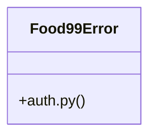

# Auth Service

> 47 nodes · cohesion 0.08

## Key Concepts

- [client.py](file:///C:/Users/Gustavo/Desktop/automa%C3%A7%C3%A3o%20ifood/src/food99_automacao/client.py#L1) (21 connections)
- [get_auth_token()](file:///C:/Users/Gustavo/Desktop/automa%C3%A7%C3%A3o%20ifood/src/food99_automacao/auth.py#L70) (15 connections)
- [auth.py](file:///C:/Users/Gustavo/Desktop/automa%C3%A7%C3%A3o%20ifood/src/food99_automacao/auth.py#L1) (11 connections)
- [checar()](file:///C:/Users/Gustavo/Desktop/automa%C3%A7%C3%A3o%20ifood/src/food99_automacao/auth.py#L37) (8 connections)
- [_get()](file:///C:/Users/Gustavo/Desktop/automa%C3%A7%C3%A3o%20ifood/src/food99_automacao/client.py#L30) (8 connections)
- [_post()](file:///C:/Users/Gustavo/Desktop/automa%C3%A7%C3%A3o%20ifood/src/food99_automacao/client.py#L36) (8 connections)
- [refresh_auth_token()](file:///C:/Users/Gustavo/Desktop/automa%C3%A7%C3%A3o%20ifood/src/food99_automacao/auth.py#L48) (6 connections)
- [get_menu_task_info()](file:///C:/Users/Gustavo/Desktop/automa%C3%A7%C3%A3o%20ifood/src/food99_automacao/client.py#L145) (6 connections)
- [list_items()](file:///C:/Users/Gustavo/Desktop/automa%C3%A7%C3%A3o%20ifood/src/food99_automacao/client.py#L76) (6 connections)
- [list_items_v3()](file:///C:/Users/Gustavo/Desktop/automa%C3%A7%C3%A3o%20ifood/src/food99_automacao/client.py#L81) (6 connections)
- [list_shops()](file:///C:/Users/Gustavo/Desktop/automa%C3%A7%C3%A3o%20ifood/src/food99_automacao/client.py#L216) (6 connections)
- [update_item_v3()](file:///C:/Users/Gustavo/Desktop/automa%C3%A7%C3%A3o%20ifood/src/food99_automacao/client.py#L102) (6 connections)
- [_app_id()](file:///C:/Users/Gustavo/Desktop/automa%C3%A7%C3%A3o%20ifood/src/food99_automacao/auth.py#L29) (5 connections)
- [_buscar_token()](file:///C:/Users/Gustavo/Desktop/automa%C3%A7%C3%A3o%20ifood/src/food99_automacao/auth.py#L59) (5 connections)
- [criar_item()](file:///C:/Users/Gustavo/Desktop/automa%C3%A7%C3%A3o%20ifood/src/food99_automacao/client.py#L165) (5 connections)
- [order_detail()](file:///C:/Users/Gustavo/Desktop/automa%C3%A7%C3%A3o%20ifood/src/food99_automacao/client.py#L44) (5 connections)
- [upload_menu()](file:///C:/Users/Gustavo/Desktop/automa%C3%A7%C3%A3o%20ifood/src/food99_automacao/client.py#L126) (5 connections)
- [_app_secret()](file:///C:/Users/Gustavo/Desktop/automa%C3%A7%C3%A3o%20ifood/src/food99_automacao/auth.py#L33) (4 connections)
- [Food99Error](file:///C:/Users/Gustavo/Desktop/automa%C3%A7%C3%A3o%20ifood/src/food99_automacao/auth.py#L25) (4 connections)
- [gerar_sign()](file:///C:/Users/Gustavo/Desktop/automa%C3%A7%C3%A3o%20ifood/src/food99_automacao/auth.py#L86) (4 connections)
- [get_authorization_url()](file:///C:/Users/Gustavo/Desktop/automa%C3%A7%C3%A3o%20ifood/src/food99_automacao/auth.py#L102) (4 connections)
- [_achar_item_v3()](file:///C:/Users/Gustavo/Desktop/automa%C3%A7%C3%A3o%20ifood/src/food99_automacao/client.py#L95) (4 connections)
- [aguardar_upload()](file:///C:/Users/Gustavo/Desktop/automa%C3%A7%C3%A3o%20ifood/src/food99_automacao/client.py#L150) (4 connections)
- [cancel_order()](file:///C:/Users/Gustavo/Desktop/automa%C3%A7%C3%A3o%20ifood/src/food99_automacao/client.py#L54) (4 connections)
- [confirm_order()](file:///C:/Users/Gustavo/Desktop/automa%C3%A7%C3%A3o%20ifood/src/food99_automacao/client.py#L49) (4 connections)
- *... and 22 more nodes in this community*

## Class Diagram

## Relationships

- [[Community 2]] (2 shared connections)

## Source Files

- [C:\Users\Gustavo\Desktop\automação ifood\src\food99_automacao\auth.py](file:///C:/Users/Gustavo/Desktop/automa%C3%A7%C3%A3o%20ifood/src/food99_automacao/auth.py)
- [C:\Users\Gustavo\Desktop\automação ifood\src\food99_automacao\client.py](file:///C:/Users/Gustavo/Desktop/automa%C3%A7%C3%A3o%20ifood/src/food99_automacao/client.py)
- [C:\Users\Gustavo\Desktop\automação ifood\src\ifood_automacao\client.py](file:///C:/Users/Gustavo/Desktop/automa%C3%A7%C3%A3o%20ifood/src/ifood_automacao/client.py)

## Audit Trail

- EXTRACTED: 162 (83%)
- INFERRED: 34 (17%)
- AMBIGUOUS: 0 (0%)

---

*Part of the graphify knowledge wiki. See [[index]] to navigate.*