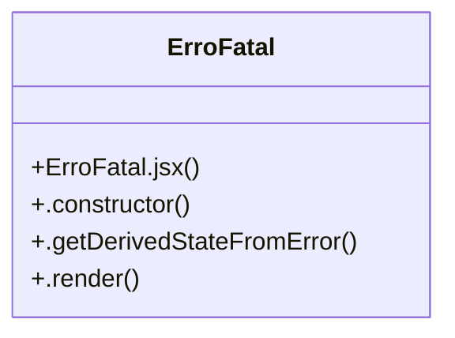

# Community 1

> 92 nodes · cohesion 0.03

## Key Concepts

- [lucide-react](file:///C:/Users/Gustavo/Desktop/automa%C3%A7%C3%A3o%20ifood/viewer/package.json#L13) (24 connections)
- [react](file:///C:/Users/Gustavo/Desktop/automa%C3%A7%C3%A3o%20ifood/viewer/package.json#L14) (22 connections)
- [Graficos.jsx](file:///C:/Users/Gustavo/Desktop/automa%C3%A7%C3%A3o%20ifood/viewer/src/Graficos.jsx#L1) (18 connections)
- [TelasAuth.jsx](file:///C:/Users/Gustavo/Desktop/automa%C3%A7%C3%A3o%20ifood/automa-o-apis-delivery/viewer/src/TelasAuth.jsx#L1) (14 connections)
- [KDSView.jsx](file:///C:/Users/Gustavo/Desktop/automa%C3%A7%C3%A3o%20ifood/viewer/src/views/KDSView.jsx#L1) (12 connections)
- [TelasAuth.jsx](file:///C:/Users/Gustavo/Desktop/automa%C3%A7%C3%A3o%20ifood/viewer/src/TelasAuth.jsx#L1) (9 connections)
- [HorarioFuncionamentoModal.jsx](file:///C:/Users/Gustavo/Desktop/automa%C3%A7%C3%A3o%20ifood/viewer/src/modals/HorarioFuncionamentoModal.jsx#L1) (7 connections)
- [OrderDrawer.tsx](file:///C:/Users/Gustavo/Desktop/automa%C3%A7%C3%A3o%20ifood/sistema-pedidos/frontend/src/components/OrderDrawer.tsx#L1) (6 connections)
- [Sidebar.jsx](file:///C:/Users/Gustavo/Desktop/automa%C3%A7%C3%A3o%20ifood/viewer/src/Sidebar.jsx#L1) (5 connections)
- [GruposOpcaoModal.jsx](file:///C:/Users/Gustavo/Desktop/automa%C3%A7%C3%A3o%20ifood/viewer/src/modals/GruposOpcaoModal.jsx#L1) (4 connections)
- [ErroFatal](file:///C:/Users/Gustavo/Desktop/automa%C3%A7%C3%A3o%20ifood/viewer/src/ErroFatal.jsx#L6) (4 connections)
- [estiloInput()](file:///C:/Users/Gustavo/Desktop/automa%C3%A7%C3%A3o%20ifood/viewer/src/TelasAuth.jsx#L24) (4 connections)
- [Layout.tsx](file:///C:/Users/Gustavo/Desktop/automa%C3%A7%C3%A3o%20ifood/sistema-pedidos/frontend/src/components/Layout.tsx#L1) (3 connections)
- [ErroFatal.jsx](file:///C:/Users/Gustavo/Desktop/automa%C3%A7%C3%A3o%20ifood/viewer/src/ErroFatal.jsx#L1) (3 connections)
- [CategoriasModal.jsx](file:///C:/Users/Gustavo/Desktop/automa%C3%A7%C3%A3o%20ifood/viewer/src/modals/CategoriasModal.jsx#L1) (3 connections)
- [ComboModal.jsx](file:///C:/Users/Gustavo/Desktop/automa%C3%A7%C3%A3o%20ifood/viewer/src/modals/ComboModal.jsx#L1) (3 connections)
- [InterrupcoesModal.jsx](file:///C:/Users/Gustavo/Desktop/automa%C3%A7%C3%A3o%20ifood/viewer/src/modals/InterrupcoesModal.jsx#L1) (3 connections)
- [CatalogoView.jsx](file:///C:/Users/Gustavo/Desktop/automa%C3%A7%C3%A3o%20ifood/viewer/src/views/CatalogoView.jsx#L1) (3 connections)
- [PainelEsqueciSenha()](file:///C:/Users/Gustavo/Desktop/automa%C3%A7%C3%A3o%20ifood/viewer/src/TelasAuth.jsx#L37) (3 connections)
- [TelaDefinirSenha()](file:///C:/Users/Gustavo/Desktop/automa%C3%A7%C3%A3o%20ifood/viewer/src/TelasAuth.jsx#L202) (3 connections)
- [TelaLogin()](file:///C:/Users/Gustavo/Desktop/automa%C3%A7%C3%A3o%20ifood/viewer/src/TelasAuth.jsx#L108) (3 connections)
- [Sidebar.tsx](file:///C:/Users/Gustavo/Desktop/automa%C3%A7%C3%A3o%20ifood/sistema-pedidos/frontend/src/components/Sidebar.tsx#L1) (2 connections)
- [useWebSocket.ts](file:///C:/Users/Gustavo/Desktop/automa%C3%A7%C3%A3o%20ifood/sistema-pedidos/frontend/src/hooks/useWebSocket.ts#L1) (2 connections)
- [StubPage.tsx](file:///C:/Users/Gustavo/Desktop/automa%C3%A7%C3%A3o%20ifood/sistema-pedidos/frontend/src/pages/StubPage.tsx#L1) (2 connections)
- [AuditoriaView.jsx](file:///C:/Users/Gustavo/Desktop/automa%C3%A7%C3%A3o%20ifood/viewer/src/views/AuditoriaView.jsx#L1) (2 connections)
- *... and 67 more nodes in this community*

## Class Diagram

## Relationships

- No strong cross-community connections detected

## Source Files

- [C:\Users\Gustavo\Desktop\automação ifood\automa-o-apis-delivery\viewer\src\TelasAuth.jsx](file:///C:/Users/Gustavo/Desktop/automa%C3%A7%C3%A3o%20ifood/automa-o-apis-delivery/viewer/src/TelasAuth.jsx)
- [C:\Users\Gustavo\Desktop\automação ifood\automa-o-apis-delivery\viewer\src\main.jsx](file:///C:/Users/Gustavo/Desktop/automa%C3%A7%C3%A3o%20ifood/automa-o-apis-delivery/viewer/src/main.jsx)
- [C:\Users\Gustavo\Desktop\automação ifood\sistema-pedidos\frontend\src\components\Layout.tsx](file:///C:/Users/Gustavo/Desktop/automa%C3%A7%C3%A3o%20ifood/sistema-pedidos/frontend/src/components/Layout.tsx)
- [C:\Users\Gustavo\Desktop\automação ifood\sistema-pedidos\frontend\src\components\OrderDrawer.tsx](file:///C:/Users/Gustavo/Desktop/automa%C3%A7%C3%A3o%20ifood/sistema-pedidos/frontend/src/components/OrderDrawer.tsx)
- [C:\Users\Gustavo\Desktop\automação ifood\sistema-pedidos\frontend\src\components\Sidebar.tsx](file:///C:/Users/Gustavo/Desktop/automa%C3%A7%C3%A3o%20ifood/sistema-pedidos/frontend/src/components/Sidebar.tsx)
- [C:\Users\Gustavo\Desktop\automação ifood\sistema-pedidos\frontend\src\hooks\useWebSocket.ts](file:///C:/Users/Gustavo/Desktop/automa%C3%A7%C3%A3o%20ifood/sistema-pedidos/frontend/src/hooks/useWebSocket.ts)
- [C:\Users\Gustavo\Desktop\automação ifood\sistema-pedidos\frontend\src\main.tsx](file:///C:/Users/Gustavo/Desktop/automa%C3%A7%C3%A3o%20ifood/sistema-pedidos/frontend/src/main.tsx)
- [C:\Users\Gustavo\Desktop\automação ifood\sistema-pedidos\frontend\src\pages\StubPage.tsx](file:///C:/Users/Gustavo/Desktop/automa%C3%A7%C3%A3o%20ifood/sistema-pedidos/frontend/src/pages/StubPage.tsx)
- [C:\Users\Gustavo\Desktop\automação ifood\viewer\src\ErroFatal.jsx](file:///C:/Users/Gustavo/Desktop/automa%C3%A7%C3%A3o%20ifood/viewer/src/ErroFatal.jsx)
- [C:\Users\Gustavo\Desktop\automação ifood\viewer\src\Graficos.jsx](file:///C:/Users/Gustavo/Desktop/automa%C3%A7%C3%A3o%20ifood/viewer/src/Graficos.jsx)
- [C:\Users\Gustavo\Desktop\automação ifood\viewer\src\Sidebar.jsx](file:///C:/Users/Gustavo/Desktop/automa%C3%A7%C3%A3o%20ifood/viewer/src/Sidebar.jsx)
- [C:\Users\Gustavo\Desktop\automação ifood\viewer\src\TelasAuth.jsx](file:///C:/Users/Gustavo/Desktop/automa%C3%A7%C3%A3o%20ifood/viewer/src/TelasAuth.jsx)
- [C:\Users\Gustavo\Desktop\automação ifood\viewer\src\main.jsx](file:///C:/Users/Gustavo/Desktop/automa%C3%A7%C3%A3o%20ifood/viewer/src/main.jsx)
- [C:\Users\Gustavo\Desktop\automação ifood\viewer\src\modals\CategoriasModal.jsx](file:///C:/Users/Gustavo/Desktop/automa%C3%A7%C3%A3o%20ifood/viewer/src/modals/CategoriasModal.jsx)
- [C:\Users\Gustavo\Desktop\automação ifood\viewer\src\modals\ComboModal.jsx](file:///C:/Users/Gustavo/Desktop/automa%C3%A7%C3%A3o%20ifood/viewer/src/modals/ComboModal.jsx)
- [C:\Users\Gustavo\Desktop\automação ifood\viewer\src\modals\GruposOpcaoModal.jsx](file:///C:/Users/Gustavo/Desktop/automa%C3%A7%C3%A3o%20ifood/viewer/src/modals/GruposOpcaoModal.jsx)
- [C:\Users\Gustavo\Desktop\automação ifood\viewer\src\modals\HorarioFuncionamentoModal.jsx](file:///C:/Users/Gustavo/Desktop/automa%C3%A7%C3%A3o%20ifood/viewer/src/modals/HorarioFuncionamentoModal.jsx)
- [C:\Users\Gustavo\Desktop\automação ifood\viewer\src\modals\InterrupcoesModal.jsx](file:///C:/Users/Gustavo/Desktop/automa%C3%A7%C3%A3o%20ifood/viewer/src/modals/InterrupcoesModal.jsx)
- [C:\Users\Gustavo\Desktop\automação ifood\viewer\src\views\AuditoriaView.jsx](file:///C:/Users/Gustavo/Desktop/automa%C3%A7%C3%A3o%20ifood/viewer/src/views/AuditoriaView.jsx)
- [C:\Users\Gustavo\Desktop\automação ifood\viewer\src\views\CatalogoView.jsx](file:///C:/Users/Gustavo/Desktop/automa%C3%A7%C3%A3o%20ifood/viewer/src/views/CatalogoView.jsx)

## Audit Trail

- EXTRACTED: 235 (100%)
- INFERRED: 0 (0%)
- AMBIGUOUS: 0 (0%)

---

*Part of the graphify knowledge wiki. See [[index]] to navigate.*