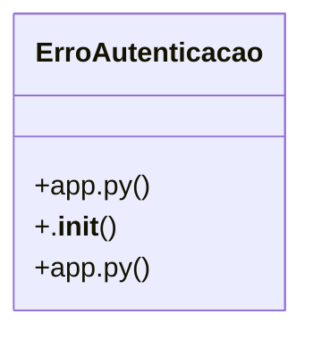

# Community 10

> 8 nodes · cohesion 0.25

## Key Concepts

- [ErroAutenticacao](file:///C:/Users/Gustavo/Desktop/automa%C3%A7%C3%A3o%20ifood/server/app.py#L105) (7 connections)
- [tratar_erro()](file:///C:/Users/Gustavo/Desktop/automa%C3%A7%C3%A3o%20ifood/server/app.py#L233) (5 connections)
- **Exception** (2 connections)
- [.__init__()](file:///C:/Users/Gustavo/Desktop/automa%C3%A7%C3%A3o%20ifood/server/app.py#L108) (1 connections)
- [Falha de login/permissão — sessão ausente/expirada (401) ou papel sem acesso (40](file:///C:/Users/Gustavo/Desktop/automa%C3%A7%C3%A3o%20ifood/server/app.py#L106) (1 connections)
- [Converte qualquer falha (login, rede, API do iFood/Supabase, validação) numa res](file:///C:/Users/Gustavo/Desktop/automa%C3%A7%C3%A3o%20ifood/automa-o-apis-delivery/server/app.py#L210) (1 connections)
- [Converte qualquer falha (login, rede, API do iFood/Supabase, validação) numa res](file:///C:/Users/Gustavo/Desktop/automa%C3%A7%C3%A3o%20ifood/server/app.py#L234) (1 connections)
- [Falha de login/permissão — sessão ausente/expirada (401) ou papel sem acesso (40](file:///C:/Users/Gustavo/Desktop/automa%C3%A7%C3%A3o%20ifood/automa-o-apis-delivery/server/app.py#L85) (1 connections)

## Class Diagram

## Relationships

- No strong cross-community connections detected

## Source Files

- [C:\Users\Gustavo\Desktop\automação ifood\automa-o-apis-delivery\server\app.py](file:///C:/Users/Gustavo/Desktop/automa%C3%A7%C3%A3o%20ifood/automa-o-apis-delivery/server/app.py)
- [C:\Users\Gustavo\Desktop\automação ifood\server\app.py](file:///C:/Users/Gustavo/Desktop/automa%C3%A7%C3%A3o%20ifood/server/app.py)

## Audit Trail

- EXTRACTED: 19 (100%)
- INFERRED: 0 (0%)
- AMBIGUOUS: 0 (0%)

---

*Part of the graphify knowledge wiki. See [[index]] to navigate.*