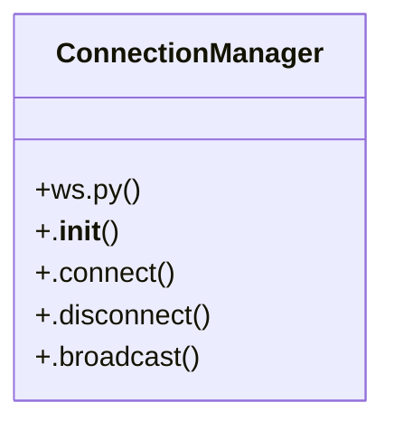

# Community 10

> 16 nodes · cohesion 0.16

## Key Concepts

- [main.py](file:///C:/Users/Gustavo/Desktop/automa%C3%A7%C3%A3o%20ifood/sistema-pedidos/backend/app/main.py#L1) (9 connections)
- [ConnectionManager](file:///C:/Users/Gustavo/Desktop/automa%C3%A7%C3%A3o%20ifood/sistema-pedidos/backend/app/ws.py#L8) (5 connections)
- [ws.py](file:///C:/Users/Gustavo/Desktop/automa%C3%A7%C3%A3o%20ifood/sistema-pedidos/backend/app/ws.py#L1) (4 connections)
- [.broadcast()](file:///C:/Users/Gustavo/Desktop/automa%C3%A7%C3%A3o%20ifood/sistema-pedidos/backend/app/ws.py#L20) (4 connections)
- [webhook_99food()](file:///C:/Users/Gustavo/Desktop/automa%C3%A7%C3%A3o%20ifood/sistema-pedidos/backend/app/main.py#L67) (3 connections)
- [ws_endpoint()](file:///C:/Users/Gustavo/Desktop/automa%C3%A7%C3%A3o%20ifood/sistema-pedidos/backend/app/main.py#L80) (3 connections)
- [.disconnect()](file:///C:/Users/Gustavo/Desktop/automa%C3%A7%C3%A3o%20ifood/sistema-pedidos/backend/app/ws.py#L16) (3 connections)
- [_registrar_evento_99()](file:///C:/Users/Gustavo/Desktop/automa%C3%A7%C3%A3o%20ifood/sistema-pedidos/backend/app/main.py#L50) (2 connections)
- [webhook_99food_check()](file:///C:/Users/Gustavo/Desktop/automa%C3%A7%C3%A3o%20ifood/sistema-pedidos/backend/app/main.py#L61) (2 connections)
- [.connect()](file:///C:/Users/Gustavo/Desktop/automa%C3%A7%C3%A3o%20ifood/sistema-pedidos/backend/app/ws.py#L12) (2 connections)
- [health()](file:///C:/Users/Gustavo/Desktop/automa%C3%A7%C3%A3o%20ifood/sistema-pedidos/backend/app/main.py#L41) (1 connections)
- [App FastAPI: REST de pedidos + WebSocket para push em tempo real.](file:///C:/Users/Gustavo/Desktop/automa%C3%A7%C3%A3o%20ifood/sistema-pedidos/backend/app/main.py#L1) (1 connections)
- [Verificação/health que o portal do 99 pode fazer ao cadastrar o webhook.](file:///C:/Users/Gustavo/Desktop/automa%C3%A7%C3%A3o%20ifood/sistema-pedidos/backend/app/main.py#L62) (1 connections)
- [Recebe os eventos que o 99Food empurra. Responde errno:0 pra confirmar.](file:///C:/Users/Gustavo/Desktop/automa%C3%A7%C3%A3o%20ifood/sistema-pedidos/backend/app/main.py#L68) (1 connections)
- [.__init__()](file:///C:/Users/Gustavo/Desktop/automa%C3%A7%C3%A3o%20ifood/sistema-pedidos/backend/app/ws.py#L9) (1 connections)
- [Push de eventos em tempo real para o frontend (novo pedido, mudança de status).](file:///C:/Users/Gustavo/Desktop/automa%C3%A7%C3%A3o%20ifood/sistema-pedidos/backend/app/ws.py#L1) (1 connections)

## Class Diagram

## Relationships

- No strong cross-community connections detected

## Source Files

- [C:\Users\Gustavo\Desktop\automação ifood\sistema-pedidos\backend\app\main.py](file:///C:/Users/Gustavo/Desktop/automa%C3%A7%C3%A3o%20ifood/sistema-pedidos/backend/app/main.py)
- [C:\Users\Gustavo\Desktop\automação ifood\sistema-pedidos\backend\app\ws.py](file:///C:/Users/Gustavo/Desktop/automa%C3%A7%C3%A3o%20ifood/sistema-pedidos/backend/app/ws.py)

## Audit Trail

- EXTRACTED: 37 (86%)
- INFERRED: 6 (14%)
- AMBIGUOUS: 0 (0%)

---

*Part of the graphify knowledge wiki. See [[index]] to navigate.*