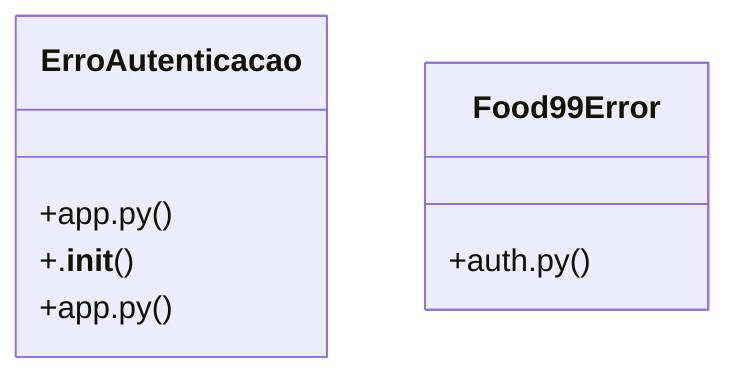

# Community 13

> 13 nodes · cohesion 0.15

## Key Concepts

- [ErroAutenticacao](file:///C:/Users/Gustavo/Desktop/automa%C3%A7%C3%A3o%20ifood/server/app.py#L126) (7 connections)
- [tratar_erro()](file:///C:/Users/Gustavo/Desktop/automa%C3%A7%C3%A3o%20ifood/server/app.py#L261) (6 connections)
- [usuario_atual()](file:///C:/Users/Gustavo/Desktop/automa%C3%A7%C3%A3o%20ifood/server/app.py#L134) (6 connections)
- [Food99Error](file:///C:/Users/Gustavo/Desktop/automa%C3%A7%C3%A3o%20ifood/src/food99_automacao/auth.py#L25) (4 connections)
- **Exception** (3 connections)
- [.__init__()](file:///C:/Users/Gustavo/Desktop/automa%C3%A7%C3%A3o%20ifood/server/app.py#L129) (1 connections)
- [Falha de login/permissão — sessão ausente/expirada (401) ou papel sem acesso (40](file:///C:/Users/Gustavo/Desktop/automa%C3%A7%C3%A3o%20ifood/server/app.py#L127) (1 connections)
- [Valida a sessão (header Authorization: Bearer <token>, emitido pelo Supabase Aut](file:///C:/Users/Gustavo/Desktop/automa%C3%A7%C3%A3o%20ifood/server/app.py#L135) (1 connections)
- [Converte qualquer falha (login, rede, API do iFood/Supabase, validação) numa res](file:///C:/Users/Gustavo/Desktop/automa%C3%A7%C3%A3o%20ifood/automa-o-apis-delivery/server/app.py#L210) (1 connections)
- [Converte qualquer falha (login, rede, API do iFood/Supabase, validação) numa res](file:///C:/Users/Gustavo/Desktop/automa%C3%A7%C3%A3o%20ifood/server/app.py#L262) (1 connections)
- [Falha de login/permissão — sessão ausente/expirada (401) ou papel sem acesso (40](file:///C:/Users/Gustavo/Desktop/automa%C3%A7%C3%A3o%20ifood/automa-o-apis-delivery/server/app.py#L85) (1 connections)
- [Valida a sessão (header Authorization: Bearer <token>, emitido pelo Supabase Aut](file:///C:/Users/Gustavo/Desktop/automa%C3%A7%C3%A3o%20ifood/automa-o-apis-delivery/server/app.py#L93) (1 connections)
- [Erro de negócio devolvido pela API (errno != 0).](file:///C:/Users/Gustavo/Desktop/automa%C3%A7%C3%A3o%20ifood/src/food99_automacao/auth.py#L26) (1 connections)

## Class Diagram

## Relationships

- [[Community 16]] (4 shared connections)
- [[iFood Menu API]] (2 shared connections)
- [[Auth Service]] (1 shared connections)

## Source Files

- [C:/Users/Gustavo/Desktop/automação ifood/automa-o-apis-delivery/server/app.py](file:///C:/Users/Gustavo/Desktop/automa%C3%A7%C3%A3o%20ifood/automa-o-apis-delivery/server/app.py)
- [C:\Users\Gustavo\Desktop\automação ifood\server\app.py](file:///C:/Users/Gustavo/Desktop/automa%C3%A7%C3%A3o%20ifood/server/app.py)
- [C:\Users\Gustavo\Desktop\automação ifood\src\food99_automacao\auth.py](file:///C:/Users/Gustavo/Desktop/automa%C3%A7%C3%A3o%20ifood/src/food99_automacao/auth.py)

## Audit Trail

- EXTRACTED: 33 (97%)
- INFERRED: 1 (3%)
- AMBIGUOUS: 0 (0%)

---

*Part of the graphify knowledge wiki. See [[index]] to navigate.*