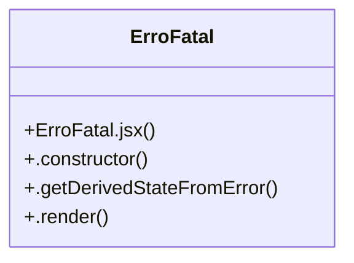

# Community 14

> 5 nodes · cohesion 0.40

## Key Concepts

- [ErroFatal](file:///C:/Users/Gustavo/Desktop/automa%C3%A7%C3%A3o%20ifood/viewer/src/ErroFatal.jsx#L6) (4 connections)
- [ErroFatal.jsx](file:///C:/Users/Gustavo/Desktop/automa%C3%A7%C3%A3o%20ifood/viewer/src/ErroFatal.jsx#L1) (1 connections)
- [.constructor()](file:///C:/Users/Gustavo/Desktop/automa%C3%A7%C3%A3o%20ifood/viewer/src/ErroFatal.jsx#L7) (1 connections)
- [.getDerivedStateFromError()](file:///C:/Users/Gustavo/Desktop/automa%C3%A7%C3%A3o%20ifood/viewer/src/ErroFatal.jsx#L12) (1 connections)
- [.render()](file:///C:/Users/Gustavo/Desktop/automa%C3%A7%C3%A3o%20ifood/viewer/src/ErroFatal.jsx#L16) (1 connections)

## Class Diagram

## Relationships

- No strong cross-community connections detected

## Source Files

- [C:\Users\Gustavo\Desktop\automação ifood\viewer\src\ErroFatal.jsx](file:///C:/Users/Gustavo/Desktop/automa%C3%A7%C3%A3o%20ifood/viewer/src/ErroFatal.jsx)

## Audit Trail

- EXTRACTED: 8 (100%)
- INFERRED: 0 (0%)
- AMBIGUOUS: 0 (0%)

---

*Part of the graphify knowledge wiki. See [[index]] to navigate.*