# Community 3

> 66 nodes · cohesion 0.08

## Key Concepts

- [OrderStatus](file:///C:/Users/Gustavo/Desktop/automa%C3%A7%C3%A3o%20ifood/sistema-pedidos/backend/app/enums.py#L5) (30 connections)
- [OrderType](file:///C:/Users/Gustavo/Desktop/automa%C3%A7%C3%A3o%20ifood/sistema-pedidos/backend/app/enums.py#L15) (27 connections)
- [schemas.py](file:///C:/Users/Gustavo/Desktop/automa%C3%A7%C3%A3o%20ifood/sistema-pedidos/backend/app/schemas.py#L1) (14 connections)
- **BaseModel** (11 connections)
- [crud.py](file:///C:/Users/Gustavo/Desktop/automa%C3%A7%C3%A3o%20ifood/sistema-pedidos/backend/app/crud.py#L1) (11 connections)
- [main()](file:///C:/Users/Gustavo/Desktop/automa%C3%A7%C3%A3o%20ifood/sistema-pedidos/backend/seed.py#L105) (11 connections)
- [models.py](file:///C:/Users/Gustavo/Desktop/automa%C3%A7%C3%A3o%20ifood/sistema-pedidos/backend/app/models.py#L1) (10 connections)
- [enums.py](file:///C:/Users/Gustavo/Desktop/automa%C3%A7%C3%A3o%20ifood/sistema-pedidos/backend/app/enums.py#L1) (9 connections)
- [orders.py](file:///C:/Users/Gustavo/Desktop/automa%C3%A7%C3%A3o%20ifood/sistema-pedidos/backend/app/routers/orders.py#L1) (9 connections)
- [Base](file:///C:/Users/Gustavo/Desktop/automa%C3%A7%C3%A3o%20ifood/sistema-pedidos/backend/app/database.py#L19) (9 connections)
- [OrderEvent](file:///C:/Users/Gustavo/Desktop/automa%C3%A7%C3%A3o%20ifood/sistema-pedidos/backend/app/models.py#L124) (9 connections)
- [OrderCreate](file:///C:/Users/Gustavo/Desktop/automa%C3%A7%C3%A3o%20ifood/sistema-pedidos/backend/app/schemas.py#L123) (9 connections)
- [create_order()](file:///C:/Users/Gustavo/Desktop/automa%C3%A7%C3%A3o%20ifood/sistema-pedidos/backend/app/crud.py#L95) (8 connections)
- [database.py](file:///C:/Users/Gustavo/Desktop/automa%C3%A7%C3%A3o%20ifood/sistema-pedidos/backend/app/database.py#L1) (7 connections)
- [seed.py](file:///C:/Users/Gustavo/Desktop/automa%C3%A7%C3%A3o%20ifood/sistema-pedidos/backend/seed.py#L1) (6 connections)
- [transition_status()](file:///C:/Users/Gustavo/Desktop/automa%C3%A7%C3%A3o%20ifood/sistema-pedidos/backend/app/crud.py#L157) (6 connections)
- [ItemComplement](file:///C:/Users/Gustavo/Desktop/automa%C3%A7%C3%A3o%20ifood/sistema-pedidos/backend/app/models.py#L112) (6 connections)
- [Order](file:///C:/Users/Gustavo/Desktop/automa%C3%A7%C3%A3o%20ifood/sistema-pedidos/backend/app/models.py#L24) (6 connections)
- [OrderItem](file:///C:/Users/Gustavo/Desktop/automa%C3%A7%C3%A3o%20ifood/sistema-pedidos/backend/app/models.py#L95) (6 connections)
- [Store](file:///C:/Users/Gustavo/Desktop/automa%C3%A7%C3%A3o%20ifood/sistema-pedidos/backend/app/models.py#L12) (6 connections)
- [ComplementIn](file:///C:/Users/Gustavo/Desktop/automa%C3%A7%C3%A3o%20ifood/sistema-pedidos/backend/app/schemas.py#L108) (6 connections)
- [ItemIn](file:///C:/Users/Gustavo/Desktop/automa%C3%A7%C3%A3o%20ifood/sistema-pedidos/backend/app/schemas.py#L114) (6 connections)
- [Popula o banco com dados de teste: 4 lojas + ~20 pedidos em status variados (co](file:///C:/Users/Gustavo/Desktop/automa%C3%A7%C3%A3o%20ifood/sistema-pedidos/backend/seed.py#L1) (6 connections)
- **Base** (5 connections)
- [get_order()](file:///C:/Users/Gustavo/Desktop/automa%C3%A7%C3%A3o%20ifood/sistema-pedidos/backend/app/crud.py#L82) (5 connections)
- *... and 41 more nodes in this community*

## Class Diagram

```mermaid
classDiagram
    class Base {
        +database.py()
    }
    class OrderStatus {
        +enums.py()
    }
    class OrderType {
        +enums.py()
    }
    class ItemComplement {
        +models.py()
    }
    class Order {
        +models.py()
    }
    class OrderEvent {
        +models.py()
    }
    class OrderItem {
        +models.py()
    }
    class Store {
        +models.py()
    }
    class ComplementIn {
        +schemas.py()
    }
    class ComplementOut {
        +schemas.py()
    }
    class EventOut {
        +schemas.py()
    }
    class ItemIn {
        +schemas.py()
    }
    class ItemOut {
        +schemas.py()
    }
    class OrderCreate {
        +schemas.py()
    }
    class OrderDetail {
        +schemas.py()
    }
    class OrderSummary {
        +schemas.py()
    }
    class PaginatedOrders {
        +schemas.py()
    }
    class StoreOut {
        +schemas.py()
    }
    class TransitionIn {
        +schemas.py()
    }
    Base --> Store
    Base --> Order
    Base --> OrderItem
    Base --> ItemComplement
    Base --> OrderEvent
    OrderStatus --> Store
    OrderStatus --> Order
    OrderStatus --> OrderItem
    OrderStatus --> ItemComplement
    OrderStatus --> OrderEvent
    OrderStatus --> ComplementOut
    OrderStatus --> ItemOut
    OrderStatus --> EventOut
    OrderStatus --> StoreOut
    OrderStatus --> OrderSummary
    OrderStatus --> OrderDetail
    OrderStatus --> ComplementIn
    OrderStatus --> ItemIn
    OrderStatus --> OrderCreate
    OrderStatus --> TransitionIn
    OrderStatus --> PaginatedOrders
    OrderType --> Store
    OrderType --> Order
    OrderType --> OrderItem
    OrderType --> ItemComplement
    OrderType --> OrderEvent
    OrderType --> ComplementOut
    OrderType --> ItemOut
    OrderType --> EventOut
    OrderType --> StoreOut
    OrderType --> OrderSummary
    OrderType --> OrderDetail
    OrderType --> ComplementIn
    OrderType --> ItemIn
    OrderType --> OrderCreate
    OrderType --> TransitionIn
    OrderType --> PaginatedOrders
    ItemComplement --> Base
    ItemComplement --> OrderStatus
    ItemComplement --> OrderType
    Order --> Base
    Order --> OrderStatus
    Order --> OrderType
    OrderEvent --> Base
    OrderEvent --> OrderStatus
    OrderEvent --> OrderType
    OrderItem --> Base
    OrderItem --> OrderStatus
    OrderItem --> OrderType
    Store --> Base
    Store --> OrderStatus
    Store --> OrderType
    ComplementIn --> OrderStatus
    ComplementIn --> OrderType
    ComplementOut --> OrderStatus
    ComplementOut --> OrderType
    EventOut --> OrderStatus
    EventOut --> OrderType
    ItemIn --> OrderStatus
    ItemIn --> OrderType
    ItemOut --> OrderStatus
    ItemOut --> OrderType
    OrderCreate --> OrderStatus
    OrderCreate --> OrderType
    OrderDetail --> OrderStatus
    OrderDetail --> OrderType
    OrderSummary --> OrderStatus
    OrderSummary --> OrderType
    PaginatedOrders --> OrderStatus
    PaginatedOrders --> OrderType
    StoreOut --> OrderStatus
    StoreOut --> OrderType
    TransitionIn --> OrderStatus
    TransitionIn --> OrderType
```

## Relationships

- No strong cross-community connections detected

## Source Files

- [C:\Users\Gustavo\Desktop\automação ifood\sistema-pedidos\backend\app\__init__.py](file:///C:/Users/Gustavo/Desktop/automa%C3%A7%C3%A3o%20ifood/sistema-pedidos/backend/app/__init__.py)
- [C:\Users\Gustavo\Desktop\automação ifood\sistema-pedidos\backend\app\crud.py](file:///C:/Users/Gustavo/Desktop/automa%C3%A7%C3%A3o%20ifood/sistema-pedidos/backend/app/crud.py)
- [C:\Users\Gustavo\Desktop\automação ifood\sistema-pedidos\backend\app\database.py](file:///C:/Users/Gustavo/Desktop/automa%C3%A7%C3%A3o%20ifood/sistema-pedidos/backend/app/database.py)
- [C:\Users\Gustavo\Desktop\automação ifood\sistema-pedidos\backend\app\enums.py](file:///C:/Users/Gustavo/Desktop/automa%C3%A7%C3%A3o%20ifood/sistema-pedidos/backend/app/enums.py)
- [C:\Users\Gustavo\Desktop\automação ifood\sistema-pedidos\backend\app\main.py](file:///C:/Users/Gustavo/Desktop/automa%C3%A7%C3%A3o%20ifood/sistema-pedidos/backend/app/main.py)
- [C:\Users\Gustavo\Desktop\automação ifood\sistema-pedidos\backend\app\models.py](file:///C:/Users/Gustavo/Desktop/automa%C3%A7%C3%A3o%20ifood/sistema-pedidos/backend/app/models.py)
- [C:\Users\Gustavo\Desktop\automação ifood\sistema-pedidos\backend\app\routers\orders.py](file:///C:/Users/Gustavo/Desktop/automa%C3%A7%C3%A3o%20ifood/sistema-pedidos/backend/app/routers/orders.py)
- [C:\Users\Gustavo\Desktop\automação ifood\sistema-pedidos\backend\app\schemas.py](file:///C:/Users/Gustavo/Desktop/automa%C3%A7%C3%A3o%20ifood/sistema-pedidos/backend/app/schemas.py)
- [C:\Users\Gustavo\Desktop\automação ifood\sistema-pedidos\backend\seed.py](file:///C:/Users/Gustavo/Desktop/automa%C3%A7%C3%A3o%20ifood/sistema-pedidos/backend/seed.py)

## Audit Trail

- EXTRACTED: 181 (51%)
- INFERRED: 175 (49%)
- AMBIGUOUS: 0 (0%)

---

*Part of the graphify knowledge wiki. See [[index]] to navigate.*