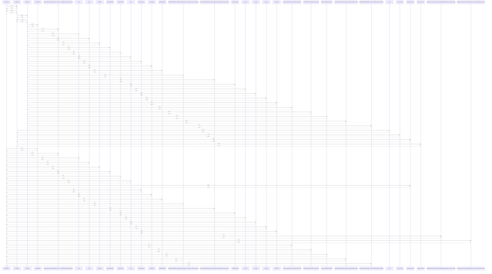

# OrderStatus

> God node · 30 connections · [C:\Users\Gustavo\Desktop\automação ifood\sistema-pedidos\backend\app\enums.py](file:///C:/Users/Gustavo/Desktop/automa%C3%A7%C3%A3o%20ifood/sistema-pedidos/backend/app/enums.py#L5)

## Call Trace Diagram

## Connections by Relation

### calls
- [[transition_status()]] `INFERRED`

### contains
- [[enums.py]] `EXTRACTED`

### inherits
- [[str]] `EXTRACTED`
- [[Enum]] `EXTRACTED`

### uses
- [[OrderEvent]] `INFERRED`
- [[OrderCreate]] `INFERRED`
- [[Popula o banco com dados de teste: 4 lojas + ~20 pedidos em status variados (co]] `INFERRED`
- [[Store]] `INFERRED`
- [[Order]] `INFERRED`
- [[OrderItem]] `INFERRED`
- [[ItemComplement]] `INFERRED`
- [[ComplementIn]] `INFERRED`
- [[ItemIn]] `INFERRED`
- [[OrderSummary]] `INFERRED`
- [[OrderDetail]] `INFERRED`
- [[PaginatedOrders]] `INFERRED`
- [[Modelos SQLAlchemy. status/tipo são gravados como string (o .value do enum) pra]] `INFERRED`
- [[Linha do tempo append-only: cada mudança de status/ação vira um evento novo,]] `INFERRED`
- [[ComplementOut]] `INFERRED`
- [[ItemOut]] `INFERRED`
- [[EventOut]] `INFERRED`
- [[StoreOut]] `INFERRED`
- [[TransitionIn]] `INFERRED`
- [[Operações de banco: listagem com filtros/paginação, detalhe, criação, transição]] `INFERRED`

---

*Part of the graphify knowledge wiki. See [[index]] to navigate.*