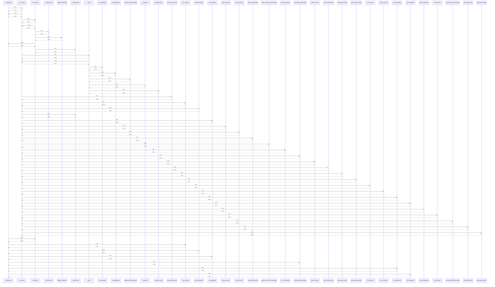

# _catalog_id()

> God node · 10 connections · [C:\Users\Gustavo\Desktop\automação ifood\server\app.py](file:///C:/Users/Gustavo/Desktop/automa%C3%A7%C3%A3o%20ifood/server/app.py#L183)

## Call Trace Diagram

## Connections by Relation

### calls
- [[com_retry()]] `INFERRED`
- [[criar_item()]] `EXTRACTED`
- [[criar_combo()]] `EXTRACTED`
- [[editar_categoria()]] `EXTRACTED`
- [[get_catalogo()]] `EXTRACTED`
- [[criar_categoria_dedicada()]] `EXTRACTED`
- [[get_categorias()]] `EXTRACTED`
- [[get_categoria()]] `EXTRACTED`

### contains
- [[app.py]] `EXTRACTED`
- [[app.py]] `EXTRACTED`

---

*Part of the graphify knowledge wiki. See [[index]] to navigate.*