# _merchant_id()

> God node · 37 connections · [C:\Users\Gustavo\Desktop\automação ifood\server\app.py](file:///C:/Users/Gustavo/Desktop/automa%C3%A7%C3%A3o%20ifood/server/app.py#L199)

## Call Trace Diagram

```mermaid
sequenceDiagram
    participant P0 as _merchant_id()
    participant P1 as criar_item()
    participant P2 as str
    participant P3 as main()
    participant P4 as convidar_usuario()
    participant P5 as resetar_senha_usuario()
    participant P6 as pausar_em_massa()
    participant P7 as criar_combo()
    participant P8 as _atualizar_status_pedido()
    participant P9 as _processar_evento_99()
    participant P10 as editar_categoria()
    participant P11 as tratar_erro()
    participant P12 as alterar_status()
    participant P13 as alterar_preco()
    participant P14 as alterar_codigo_pdv()
    participant P15 as criar_interrupcao()
    participant P16 as alterar_status_opcao()
    participant P17 as editar_opcao()
    participant P18 as editar_item()
    participant P19 as criar_categoria_dedicada()
    participant P20 as alterar_turnos()
    participant P21 as _mapear_pedido_99()
    participant P22 as criar_pedido_teste_99()
    participant P23 as get_menu_task_info()
    participant P24 as list_shops()
    participant P25 as criar_loja()
    participant P26 as alterar_papel_usuario()
    participant P27 as remover_loja()
    participant P28 as enviar_imagem()
    participant P29 as criar_grupo_opcao()
    participant P30 as criar_opcao()
    participant P31 as excluir_item()
    participant P32 as editar_item_99food()
    participant P33 as criar_item_99food()
    participant P34 as transicionar()
    participant P35 as alterar_status_pedido()
    participant P36 as alterar_status_99food()
    participant P37 as alterar_preco_99food()
    participant P38 as alterar_codigo_pdv_99food()
    participant P39 as alterar_nome_descricao_99food()
    participant P40 as catalogo_99food()
    participant P41 as main()
    participant P42 as registrar_auditoria()
    participant P43 as com_retry()
    participant P44 as _catalog_id()
    participant P45 as _categoria_id()
    participant P46 as get_catalogo()
    participant P47 as definir_horario_funcionamento()
    participant P48 as get_loja_detalhes()
    participant P49 as get_loja_disponibilidade()
    participant P50 as excluir_interrupcao()
    participant P51 as excluir_grupo_opcao()
    participant P52 as excluir_opcao()
    participant P53 as get_categorias()
    participant P54 as get_categoria()
    participant P55 as excluir_categoria()
    participant P56 as buscar_pedidos()
    participant P57 as get_horario_funcionamento()
    participant P58 as get_interrupcoes()
    participant P59 as get_grupos_opcao()
    participant P60 as get_pedidos()
    participant P61 as get_eventos()
    P0->>+ P1: calls
    P1-->>- P0: return
    P1->>+ P2: calls
    P2-->>- P1: return
    P2->>+ P1: calls
    P1-->>- P2: return
    P2->>+ P3: calls
    P3-->>- P2: return
    P2->>+ P4: calls
    P4-->>- P2: return
    P2->>+ P5: calls
    P5-->>- P2: return
    P2->>+ P6: calls
    P6-->>- P2: return
    P2->>+ P7: calls
    P7-->>- P2: return
    P2->>+ P8: calls
    P8-->>- P2: return
    P2->>+ P9: calls
    P9-->>- P2: return
    P2->>+ P10: calls
    P10-->>- P2: return
    P2->>+ P11: calls
    P11-->>- P2: return
    P2->>+ P12: calls
    P12-->>- P2: return
    P2->>+ P13: calls
    P13-->>- P2: return
    P2->>+ P14: calls
    P14-->>- P2: return
    P2->>+ P15: calls
    P15-->>- P2: return
    P2->>+ P16: calls
    P16-->>- P2: return
    P2->>+ P17: calls
    P17-->>- P2: return
    P2->>+ P18: calls
    P18-->>- P2: return
    P2->>+ P19: calls
    P19-->>- P2: return
    P2->>+ P20: calls
    P20-->>- P2: return
    P2->>+ P21: calls
    P21-->>- P2: return
    P2->>+ P22: calls
    P22-->>- P2: return
    P2->>+ P23: calls
    P23-->>- P2: return
    P2->>+ P24: calls
    P24-->>- P2: return
    P2->>+ P25: calls
    P25-->>- P2: return
    P2->>+ P26: calls
    P26-->>- P2: return
    P2->>+ P27: calls
    P27-->>- P2: return
    P2->>+ P28: calls
    P28-->>- P2: return
    P2->>+ P29: calls
    P29-->>- P2: return
    P2->>+ P30: calls
    P30-->>- P2: return
    P2->>+ P31: calls
    P31-->>- P2: return
    P2->>+ P32: calls
    P32-->>- P2: return
    P2->>+ P33: calls
    P33-->>- P2: return
    P2->>+ P34: calls
    P34-->>- P2: return
    P2->>+ P35: calls
    P35-->>- P2: return
    P2->>+ P36: calls
    P36-->>- P2: return
    P2->>+ P37: calls
    P37-->>- P2: return
    P2->>+ P38: calls
    P38-->>- P2: return
    P2->>+ P39: calls
    P39-->>- P2: return
    P2->>+ P40: calls
    P40-->>- P2: return
    P2->>+ P41: calls
    P41-->>- P2: return
    P1->>+ P42: calls
    P42-->>- P1: return
    P1->>+ P43: calls
    P43-->>- P1: return
    P1->>+ P0: calls
    P0-->>- P1: return
    P1->>+ P44: calls
    P44-->>- P1: return
    P1->>+ P45: calls
    P45-->>- P1: return
    P1->>+ P33: calls
    P33-->>- P1: return
    P0->>+ P6: calls
    P6-->>- P0: return
    P0->>+ P7: calls
    P7-->>- P0: return
    P0->>+ P10: calls
    P10-->>- P0: return
    P0->>+ P12: calls
    P12-->>- P0: return
    P0->>+ P13: calls
    P13-->>- P0: return
    P0->>+ P14: calls
    P14-->>- P0: return
    P0->>+ P15: calls
    P15-->>- P0: return
    P0->>+ P16: calls
    P16-->>- P0: return
    P0->>+ P17: calls
    P17-->>- P0: return
    P0->>+ P18: calls
    P18-->>- P0: return
    P0->>+ P19: calls
    P19-->>- P0: return
    P0->>+ P20: calls
    P20-->>- P0: return
    P0->>+ P46: calls
    P46-->>- P0: return
    P0->>+ P28: calls
    P28-->>- P0: return
    P0->>+ P47: calls
    P47-->>- P0: return
    P0->>+ P29: calls
    P29-->>- P0: return
    P0->>+ P30: calls
    P30-->>- P0: return
    P0->>+ P31: calls
    P31-->>- P0: return
    P0->>+ P48: calls
    P48-->>- P0: return
    P0->>+ P49: calls
    P49-->>- P0: return
    P0->>+ P50: calls
    P50-->>- P0: return
    P0->>+ P51: calls
    P51-->>- P0: return
    P0->>+ P52: calls
    P52-->>- P0: return
    P0->>+ P53: calls
    P53-->>- P0: return
    P0->>+ P54: calls
    P54-->>- P0: return
    P0->>+ P55: calls
    P55-->>- P0: return
    P0->>+ P56: calls
    P56-->>- P0: return
    P0->>+ P57: calls
    P57-->>- P0: return
    P0->>+ P58: calls
    P58-->>- P0: return
    P0->>+ P59: calls
    P59-->>- P0: return
    P0->>+ P60: calls
    P60-->>- P0: return
    P0->>+ P61: calls
    P61-->>- P0: return
```

## Connections by Relation

### calls
- [[criar_item()]] `EXTRACTED`
- [[pausar_em_massa()]] `EXTRACTED`
- [[criar_combo()]] `EXTRACTED`
- [[editar_categoria()]] `EXTRACTED`
- [[alterar_status()]] `EXTRACTED`
- [[alterar_preco()]] `EXTRACTED`
- [[alterar_codigo_pdv()]] `EXTRACTED`
- [[criar_interrupcao()]] `EXTRACTED`
- [[alterar_status_opcao()]] `EXTRACTED`
- [[editar_opcao()]] `EXTRACTED`
- [[editar_item()]] `EXTRACTED`
- [[criar_categoria_dedicada()]] `EXTRACTED`
- [[alterar_turnos()]] `EXTRACTED`
- [[get_catalogo()]] `EXTRACTED`
- [[enviar_imagem()]] `EXTRACTED`
- [[definir_horario_funcionamento()]] `EXTRACTED`
- [[criar_grupo_opcao()]] `EXTRACTED`
- [[criar_opcao()]] `EXTRACTED`
- [[excluir_item()]] `EXTRACTED`
- [[get_loja_detalhes()]] `EXTRACTED`

### contains
- [[app.py]] `EXTRACTED`
- [[app.py]] `EXTRACTED`

### rationale_for
- [[Loja alvo da requisição: vem de ?loja=<id> na query string, ou a padrão do .env.]] `EXTRACTED`
- [[Loja alvo da requisição: vem de ?loja=<id> na query string, ou a padrão do .env.]] `EXTRACTED`

---

*Part of the graphify knowledge wiki. See [[index]] to navigate.*