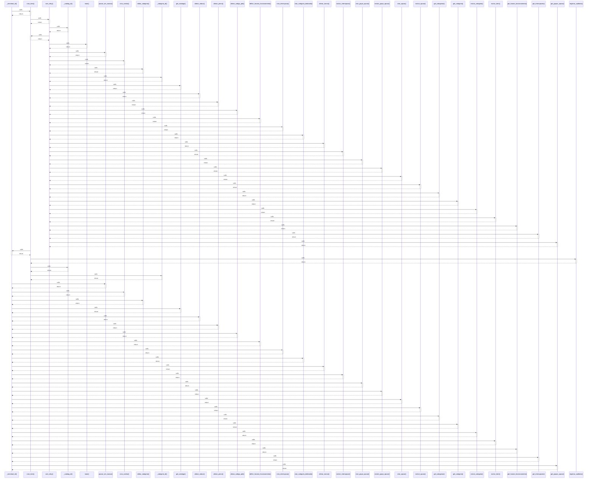

# _merchant_id()

> God node · 28 connections · [C:\Users\Gustavo\Desktop\automação ifood\server\app.py](file:///C:/Users/Gustavo/Desktop/automa%C3%A7%C3%A3o%20ifood/server/app.py#L178)

## Call Trace Diagram

## Connections by Relation

### calls
- [[criar_item()]] `EXTRACTED`
- [[pausar_em_massa()]] `EXTRACTED`
- [[criar_combo()]] `EXTRACTED`
- [[editar_categoria()]] `EXTRACTED`
- [[get_catalogo()]] `EXTRACTED`
- [[alterar_status()]] `EXTRACTED`
- [[alterar_preco()]] `EXTRACTED`
- [[alterar_codigo_pdv()]] `EXTRACTED`
- [[definir_horario_funcionamento()]] `EXTRACTED`
- [[criar_interrupcao()]] `EXTRACTED`
- [[criar_categoria_dedicada()]] `EXTRACTED`
- [[alterar_turnos()]] `EXTRACTED`
- [[excluir_interrupcao()]] `EXTRACTED`
- [[criar_grupo_opcao()]] `EXTRACTED`
- [[excluir_grupo_opcao()]] `EXTRACTED`
- [[criar_opcao()]] `EXTRACTED`
- [[excluir_opcao()]] `EXTRACTED`
- [[get_categorias()]] `EXTRACTED`
- [[get_categoria()]] `EXTRACTED`
- [[excluir_categoria()]] `EXTRACTED`

### contains
- [[app.py]] `EXTRACTED`
- [[app.py]] `EXTRACTED`

### rationale_for
- [[Loja alvo da requisição: vem de ?loja=<id> na query string, ou a padrão do .env.]] `EXTRACTED`
- [[Loja alvo da requisição: vem de ?loja=<id> na query string, ou a padrão do .env.]] `EXTRACTED`

---

*Part of the graphify knowledge wiki. See [[index]] to navigate.*