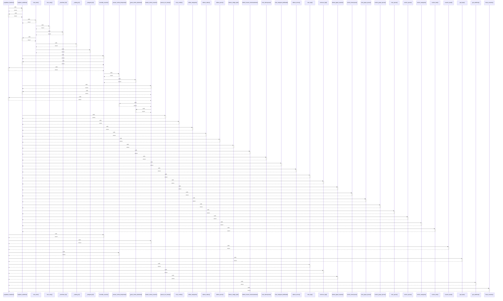

# _supabase_headers()

> God node · 13 connections · [C:\Users\Gustavo\Desktop\automação ifood\server\app.py](file:///C:/Users/Gustavo/Desktop/automa%C3%A7%C3%A3o%20ifood/server/app.py#L97)

## Call Trace Diagram

## Connections by Relation

### calls
- [[registrar_auditoria()]] `EXTRACTED`
- [[convidar_usuario()]] `EXTRACTED`
- [[resetar_senha_usuario()]] `EXTRACTED`
- [[usuario_atual()]] `EXTRACTED`
- [[_marcar_senha_temporaria()]] `EXTRACTED`
- [[get_lojas()]] `EXTRACTED`
- [[criar_loja()]] `EXTRACTED`
- [[remover_loja()]] `EXTRACTED`
- [[alterar_papel_usuario()]] `EXTRACTED`
- [[get_auditoria()]] `EXTRACTED`
- [[listar_usuarios()]] `EXTRACTED`

### contains
- [[app.py]] `EXTRACTED`
- [[app.py]] `EXTRACTED`

---

*Part of the graphify knowledge wiki. See [[index]] to navigate.*