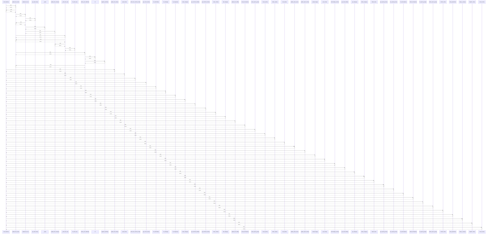

# auth_headers()

> God node · 41 connections · [C:\Users\Gustavo\Desktop\automação ifood\src\ifood_automacao\auth.py](file:///C:/Users/Gustavo/Desktop/automa%C3%A7%C3%A3o%20ifood/src/ifood_automacao/auth.py#L45)

## Call Trace Diagram

## Connections by Relation

### calls
- [[update_item_price()]] `INFERRED`
- [[update_item_status()]] `INFERRED`
- [[upsert_item()]] `INFERRED`
- [[patch_item_external_code()]] `INFERRED`
- [[get_access_token()]] `EXTRACTED`
- [[list_merchants()]] `INFERRED`
- [[list_catalogs()]] `INFERRED`
- [[list_categories()]] `INFERRED`
- [[create_category()]] `INFERRED`
- [[get_merchant_details()]] `INFERRED`
- [[get_merchant_status()]] `INFERRED`
- [[create_combo()]] `INFERRED`
- [[edit_category()]] `INFERRED`
- [[update_item_shifts()]] `INFERRED`
- [[create_interruption()]] `INFERRED`
- [[create_option_group()]] `INFERRED`
- [[create_option()]] `INFERRED`
- [[delete_option()]] `INFERRED`
- [[edit_option()]] `INFERRED`
- [[update_option_price()]] `INFERRED`

### contains
- [[auth.py]] `EXTRACTED`
- [[auth.py]] `EXTRACTED`

---

*Part of the graphify knowledge wiki. See [[index]] to navigate.*