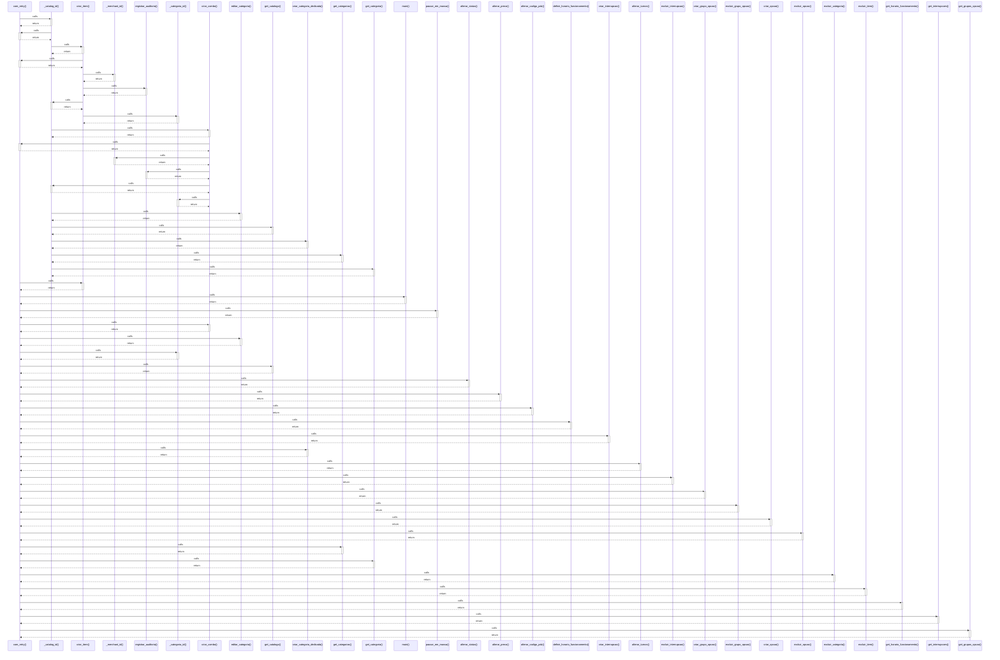

# com_retry()

> God node · 29 connections · [C:\Users\Gustavo\Desktop\automação ifood\src\ifood_automacao\rate_limit.py](file:///C:/Users/Gustavo/Desktop/automa%C3%A7%C3%A3o%20ifood/src/ifood_automacao/rate_limit.py#L7)

## Call Trace Diagram

## Connections by Relation

### calls
- [[_catalog_id()]] `INFERRED`
- [[criar_item()]] `INFERRED`
- [[main()]] `INFERRED`
- [[pausar_em_massa()]] `INFERRED`
- [[criar_combo()]] `INFERRED`
- [[editar_categoria()]] `INFERRED`
- [[_categoria_id()]] `INFERRED`
- [[get_catalogo()]] `INFERRED`
- [[alterar_status()]] `INFERRED`
- [[alterar_preco()]] `INFERRED`
- [[alterar_codigo_pdv()]] `INFERRED`
- [[definir_horario_funcionamento()]] `INFERRED`
- [[criar_interrupcao()]] `INFERRED`
- [[criar_categoria_dedicada()]] `INFERRED`
- [[alterar_turnos()]] `INFERRED`
- [[excluir_interrupcao()]] `INFERRED`
- [[criar_grupo_opcao()]] `INFERRED`
- [[excluir_grupo_opcao()]] `INFERRED`
- [[criar_opcao()]] `INFERRED`
- [[excluir_opcao()]] `INFERRED`

### contains
- [[rate_limit.py]] `EXTRACTED`
- [[rate_limit.py]] `EXTRACTED`

---

*Part of the graphify knowledge wiki. See [[index]] to navigate.*