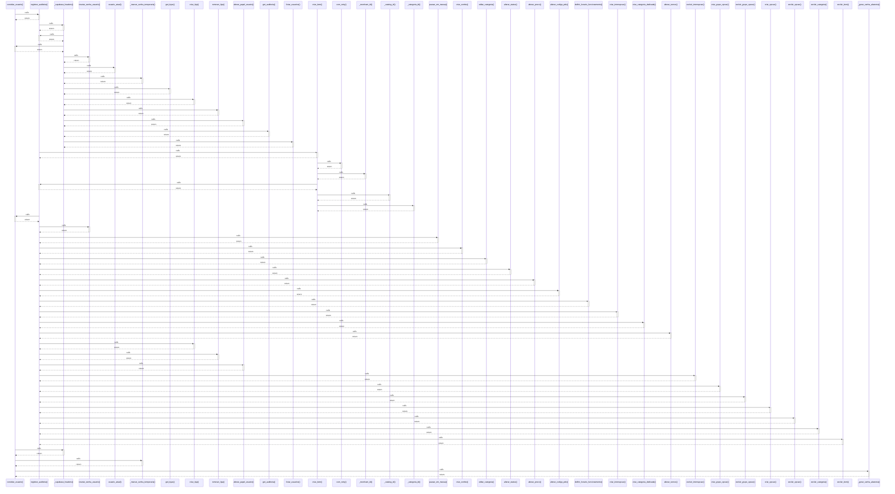

# convidar_usuario()

> God node · 8 connections · [C:\Users\Gustavo\Desktop\automação ifood\server\app.py](file:///C:/Users/Gustavo/Desktop/automa%C3%A7%C3%A3o%20ifood/server/app.py#L857)

## Call Trace Diagram

## Connections by Relation

### calls
- [[registrar_auditoria()]] `EXTRACTED`
- [[_supabase_headers()]] `EXTRACTED`
- [[_marcar_senha_temporaria()]] `EXTRACTED`
- [[_gerar_senha_aleatoria()]] `EXTRACTED`

### contains
- [[app.py]] `EXTRACTED`
- [[app.py]] `EXTRACTED`

### rationale_for
- [[Convida alguém por e-mail (Supabase manda o link de convite). O perfil (nome + p]] `EXTRACTED`
- [[Cria a conta do usuário direto pela Admin API do Supabase, já com senha definida]] `EXTRACTED`

---

*Part of the graphify knowledge wiki. See [[index]] to navigate.*