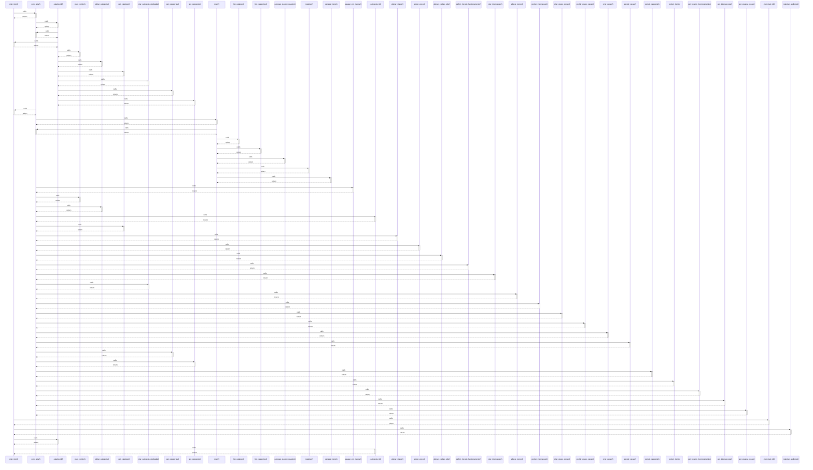

# criar_item()

> God node · 9 connections · [C:\Users\Gustavo\Desktop\automação ifood\server\app.py](file:///C:/Users/Gustavo/Desktop/automa%C3%A7%C3%A3o%20ifood/server/app.py#L476)

## Call Trace Diagram

## Connections by Relation

### calls
- [[com_retry()]] `INFERRED`
- [[_merchant_id()]] `EXTRACTED`
- [[registrar_auditoria()]] `EXTRACTED`
- [[_catalog_id()]] `EXTRACTED`
- [[_categoria_id()]] `EXTRACTED`

### contains
- [[app.py]] `EXTRACTED`
- [[app.py]] `EXTRACTED`

### rationale_for
- [[Cria um item novo. Só administrador/gerente pode — e agora isso é checado de ver]] `EXTRACTED`
- [[Cria um item novo. Só administrador/gerente pode — e agora isso é checado de ver]] `EXTRACTED`

---

*Part of the graphify knowledge wiki. See [[index]] to navigate.*