# criar_item()

> God node · 11 connections · [C:\Users\Gustavo\Desktop\automação ifood\server\app.py](file:///C:/Users/Gustavo/Desktop/automa%C3%A7%C3%A3o%20ifood/server/app.py#L611)

## Call Trace Diagram

```mermaid
sequenceDiagram
    participant P0 as criar_item()
    participant P1 as str
    participant P2 as main()
    participant P3 as com_retry()
    participant P4 as list_catalogs()
    participant P5 as list_categories()
    participant P6 as carregar_ja_processados()
    participant P7 as registrar()
    participant P8 as carregar_itens()
    participant P9 as convidar_usuario()
    participant P10 as registrar_auditoria()
    participant P11 as _supabase_headers()
    participant P12 as _marcar_senha_temporaria()
    participant P13 as _gerar_senha_aleatoria()
    participant P14 as resetar_senha_usuario()
    participant P15 as pausar_em_massa()
    participant P16 as criar_combo()
    participant P17 as _atualizar_status_pedido()
    participant P18 as _processar_evento_99()
    participant P19 as editar_categoria()
    participant P20 as tratar_erro()
    participant P21 as alterar_status()
    participant P22 as alterar_preco()
    participant P23 as alterar_codigo_pdv()
    participant P24 as criar_interrupcao()
    participant P25 as alterar_status_opcao()
    participant P26 as editar_opcao()
    participant P27 as editar_item()
    participant P28 as criar_categoria_dedicada()
    participant P29 as alterar_turnos()
    participant P30 as _mapear_pedido_99()
    participant P31 as criar_pedido_teste_99()
    participant P32 as get_menu_task_info()
    participant P33 as list_shops()
    participant P34 as criar_loja()
    participant P35 as alterar_papel_usuario()
    participant P36 as remover_loja()
    participant P37 as enviar_imagem()
    participant P38 as criar_grupo_opcao()
    participant P39 as criar_opcao()
    participant P40 as excluir_item()
    participant P41 as editar_item_99food()
    participant P42 as criar_item_99food()
    participant P43 as transicionar()
    participant P44 as alterar_status_pedido()
    participant P45 as alterar_status_99food()
    participant P46 as alterar_preco_99food()
    participant P47 as alterar_codigo_pdv_99food()
    participant P48 as alterar_nome_descricao_99food()
    participant P49 as catalogo_99food()
    participant P50 as main()
    participant P51 as _merchant_id()
    participant P52 as _catalog_id()
    participant P53 as _categoria_id()
    P0->>+ P1: calls
    P1-->>- P0: return
    P1->>+ P0: calls
    P0-->>- P1: return
    P1->>+ P2: calls
    P2-->>- P1: return
    P2->>+ P1: calls
    P1-->>- P2: return
    P2->>+ P3: calls
    P3-->>- P2: return
    P2->>+ P4: calls
    P4-->>- P2: return
    P2->>+ P5: calls
    P5-->>- P2: return
    P2->>+ P6: calls
    P6-->>- P2: return
    P2->>+ P7: calls
    P7-->>- P2: return
    P2->>+ P8: calls
    P8-->>- P2: return
    P1->>+ P9: calls
    P9-->>- P1: return
    P9->>+ P1: calls
    P1-->>- P9: return
    P9->>+ P10: calls
    P10-->>- P9: return
    P9->>+ P11: calls
    P11-->>- P9: return
    P9->>+ P12: calls
    P12-->>- P9: return
    P9->>+ P13: calls
    P13-->>- P9: return
    P1->>+ P14: calls
    P14-->>- P1: return
    P1->>+ P15: calls
    P15-->>- P1: return
    P1->>+ P16: calls
    P16-->>- P1: return
    P1->>+ P17: calls
    P17-->>- P1: return
    P1->>+ P18: calls
    P18-->>- P1: return
    P1->>+ P19: calls
    P19-->>- P1: return
    P1->>+ P20: calls
    P20-->>- P1: return
    P1->>+ P21: calls
    P21-->>- P1: return
    P1->>+ P22: calls
    P22-->>- P1: return
    P1->>+ P23: calls
    P23-->>- P1: return
    P1->>+ P24: calls
    P24-->>- P1: return
    P1->>+ P25: calls
    P25-->>- P1: return
    P1->>+ P26: calls
    P26-->>- P1: return
    P1->>+ P27: calls
    P27-->>- P1: return
    P1->>+ P28: calls
    P28-->>- P1: return
    P1->>+ P29: calls
    P29-->>- P1: return
    P1->>+ P30: calls
    P30-->>- P1: return
    P1->>+ P31: calls
    P31-->>- P1: return
    P1->>+ P32: calls
    P32-->>- P1: return
    P1->>+ P33: calls
    P33-->>- P1: return
    P1->>+ P34: calls
    P34-->>- P1: return
    P1->>+ P35: calls
    P35-->>- P1: return
    P1->>+ P36: calls
    P36-->>- P1: return
    P1->>+ P37: calls
    P37-->>- P1: return
    P1->>+ P38: calls
    P38-->>- P1: return
    P1->>+ P39: calls
    P39-->>- P1: return
    P1->>+ P40: calls
    P40-->>- P1: return
    P1->>+ P41: calls
    P41-->>- P1: return
    P1->>+ P42: calls
    P42-->>- P1: return
    P1->>+ P43: calls
    P43-->>- P1: return
    P1->>+ P44: calls
    P44-->>- P1: return
    P1->>+ P45: calls
    P45-->>- P1: return
    P1->>+ P46: calls
    P46-->>- P1: return
    P1->>+ P47: calls
    P47-->>- P1: return
    P1->>+ P48: calls
    P48-->>- P1: return
    P1->>+ P49: calls
    P49-->>- P1: return
    P1->>+ P50: calls
    P50-->>- P1: return
    P0->>+ P10: calls
    P10-->>- P0: return
    P0->>+ P3: calls
    P3-->>- P0: return
    P0->>+ P51: calls
    P51-->>- P0: return
    P0->>+ P52: calls
    P52-->>- P0: return
    P0->>+ P53: calls
    P53-->>- P0: return
    P0->>+ P42: calls
    P42-->>- P0: return
```

## Connections by Relation

### calls
- [[str]] `INFERRED`
- [[registrar_auditoria()]] `EXTRACTED`
- [[com_retry()]] `INFERRED`
- [[_merchant_id()]] `EXTRACTED`
- [[_catalog_id()]] `EXTRACTED`
- [[_categoria_id()]] `EXTRACTED`
- [[criar_item_99food()]] `EXTRACTED`

### contains
- [[app.py]] `EXTRACTED`
- [[app.py]] `EXTRACTED`

### rationale_for
- [[Cria um item novo. Só administrador/gerente pode — e agora isso é checado de ver]] `EXTRACTED`
- [[Cria um item novo. Só administrador/gerente pode — e agora isso é checado de ver]] `EXTRACTED`

---

*Part of the graphify knowledge wiki. See [[index]] to navigate.*