# get_auth_token()

> God node · 15 connections · [C:\Users\Gustavo\Desktop\automação ifood\src\food99_automacao\auth.py](file:///C:/Users/Gustavo/Desktop/automa%C3%A7%C3%A3o%20ifood/src/food99_automacao/auth.py#L70)

## Call Trace Diagram

```mermaid
sequenceDiagram
    participant P0 as get_auth_token()
    participant P1 as update_item_status()
    participant P2 as auth_headers()
    participant P3 as update_item_price()
    participant P4 as upsert_item()
    participant P5 as patch_item_external_code()
    participant P6 as get_access_token()
    participant P7 as list_merchants()
    participant P8 as list_catalogs()
    participant P9 as list_categories()
    participant P10 as create_category()
    participant P11 as get_merchant_details()
    participant P12 as get_merchant_status()
    participant P13 as create_combo()
    participant P14 as edit_category()
    participant P15 as update_item_shifts()
    participant P16 as create_interruption()
    participant P17 as create_option_group()
    participant P18 as create_option()
    participant P19 as delete_option()
    participant P20 as edit_option()
    participant P21 as update_option_price()
    participant P22 as update_option_status()
    participant P23 as upload_image()
    participant P24 as poll_events()
    participant P25 as acknowledge_events()
    participant P26 as get_order_details()
    participant P27 as get_category()
    participant P28 as delete_category()
    participant P29 as delete_item()
    participant P30 as get_opening_hours()
    participant P31 as set_opening_hours()
    participant P32 as list_interruptions()
    participant P33 as delete_interruption()
    participant P34 as list_option_groups()
    participant P35 as delete_option_group()
    participant P36 as confirm_order()
    participant P37 as start_preparation()
    participant P38 as ready_to_pickup()
    participant P39 as dispatch_order()
    participant P40 as cancel_order()
    participant P41 as _post()
    participant P42 as alterar_status_99food()
    participant P43 as refresh_auth_token()
    participant P44 as list_items()
    participant P45 as list_items_v3()
    participant P46 as update_item_v3()
    participant P47 as get_menu_task_info()
    participant P48 as _buscar_token()
    participant P49 as order_detail()
    participant P50 as upload_menu()
    participant P51 as confirm_order()
    participant P52 as cancel_order()
    participant P53 as order_ready()
    participant P54 as order_delivered()
    P0->>+ P1: calls
    P1-->>- P0: return
    P1->>+ P2: calls
    P2-->>- P1: return
    P2->>+ P3: calls
    P3-->>- P2: return
    P2->>+ P1: calls
    P1-->>- P2: return
    P2->>+ P4: calls
    P4-->>- P2: return
    P2->>+ P5: calls
    P5-->>- P2: return
    P2->>+ P6: calls
    P6-->>- P2: return
    P2->>+ P7: calls
    P7-->>- P2: return
    P2->>+ P8: calls
    P8-->>- P2: return
    P2->>+ P9: calls
    P9-->>- P2: return
    P2->>+ P10: calls
    P10-->>- P2: return
    P2->>+ P11: calls
    P11-->>- P2: return
    P2->>+ P12: calls
    P12-->>- P2: return
    P2->>+ P13: calls
    P13-->>- P2: return
    P2->>+ P14: calls
    P14-->>- P2: return
    P2->>+ P15: calls
    P15-->>- P2: return
    P2->>+ P16: calls
    P16-->>- P2: return
    P2->>+ P17: calls
    P17-->>- P2: return
    P2->>+ P18: calls
    P18-->>- P2: return
    P2->>+ P19: calls
    P19-->>- P2: return
    P2->>+ P20: calls
    P20-->>- P2: return
    P2->>+ P21: calls
    P21-->>- P2: return
    P2->>+ P22: calls
    P22-->>- P2: return
    P2->>+ P23: calls
    P23-->>- P2: return
    P2->>+ P24: calls
    P24-->>- P2: return
    P2->>+ P25: calls
    P25-->>- P2: return
    P2->>+ P26: calls
    P26-->>- P2: return
    P2->>+ P27: calls
    P27-->>- P2: return
    P2->>+ P28: calls
    P28-->>- P2: return
    P2->>+ P29: calls
    P29-->>- P2: return
    P2->>+ P30: calls
    P30-->>- P2: return
    P2->>+ P31: calls
    P31-->>- P2: return
    P2->>+ P32: calls
    P32-->>- P2: return
    P2->>+ P33: calls
    P33-->>- P2: return
    P2->>+ P34: calls
    P34-->>- P2: return
    P2->>+ P35: calls
    P35-->>- P2: return
    P2->>+ P36: calls
    P36-->>- P2: return
    P2->>+ P37: calls
    P37-->>- P2: return
    P2->>+ P38: calls
    P38-->>- P2: return
    P2->>+ P39: calls
    P39-->>- P2: return
    P2->>+ P40: calls
    P40-->>- P2: return
    P1->>+ P0: calls
    P0-->>- P1: return
    P1->>+ P41: calls
    P41-->>- P1: return
    P1->>+ P42: calls
    P42-->>- P1: return
    P0->>+ P43: calls
    P43-->>- P0: return
    P0->>+ P44: calls
    P44-->>- P0: return
    P0->>+ P45: calls
    P45-->>- P0: return
    P0->>+ P46: calls
    P46-->>- P0: return
    P0->>+ P47: calls
    P47-->>- P0: return
    P0->>+ P48: calls
    P48-->>- P0: return
    P0->>+ P49: calls
    P49-->>- P0: return
    P0->>+ P50: calls
    P50-->>- P0: return
    P0->>+ P51: calls
    P51-->>- P0: return
    P0->>+ P52: calls
    P52-->>- P0: return
    P0->>+ P53: calls
    P53-->>- P0: return
    P0->>+ P54: calls
    P54-->>- P0: return
```

## Connections by Relation

### calls
- [[update_item_status()]] `INFERRED`
- [[refresh_auth_token()]] `EXTRACTED`
- [[list_items()]] `INFERRED`
- [[list_items_v3()]] `INFERRED`
- [[update_item_v3()]] `INFERRED`
- [[get_menu_task_info()]] `INFERRED`
- [[_buscar_token()]] `EXTRACTED`
- [[order_detail()]] `INFERRED`
- [[upload_menu()]] `INFERRED`
- [[confirm_order()]] `INFERRED`
- [[cancel_order()]] `INFERRED`
- [[order_ready()]] `INFERRED`
- [[order_delivered()]] `INFERRED`

### contains
- [[auth.py]] `EXTRACTED`

### rationale_for
- [[Token válido da loja, com cache. Se não existir/expirar, faz refresh e recupera.]] `EXTRACTED`

---

*Part of the graphify knowledge wiki. See [[index]] to navigate.*