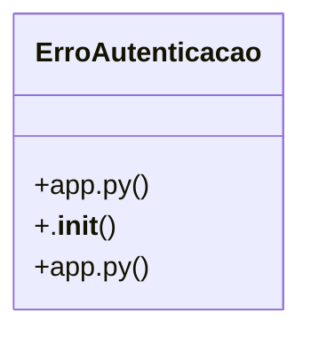

# iFood Menu API

> 147 nodes · cohesion 0.03

## Key Concepts

- [app.py](file:///C:/Users/Gustavo/Desktop/automa%C3%A7%C3%A3o%20ifood/server/app.py#L1) (84 connections)
- **str** (44 connections)
- [registrar_auditoria()](file:///C:/Users/Gustavo/Desktop/automa%C3%A7%C3%A3o%20ifood/server/app.py#L220) (39 connections)
- [com_retry()](file:///C:/Users/Gustavo/Desktop/automa%C3%A7%C3%A3o%20ifood/src/ifood_automacao/rate_limit.py#L7) (39 connections)
- [_merchant_id()](file:///C:/Users/Gustavo/Desktop/automa%C3%A7%C3%A3o%20ifood/server/app.py#L200) (37 connections)
- [app.py](file:///C:/Users/Gustavo/Desktop/automa%C3%A7%C3%A3o%20ifood/automa-o-apis-delivery/server/app.py#L1) (27 connections)
- [_supabase_headers()](file:///C:/Users/Gustavo/Desktop/automa%C3%A7%C3%A3o%20ifood/server/app.py#L119) (24 connections)
- [criar_item()](file:///C:/Users/Gustavo/Desktop/automa%C3%A7%C3%A3o%20ifood/server/app.py#L636) (11 connections)
- [_catalog_id()](file:///C:/Users/Gustavo/Desktop/automa%C3%A7%C3%A3o%20ifood/server/app.py#L205) (10 connections)
- [convidar_usuario()](file:///C:/Users/Gustavo/Desktop/automa%C3%A7%C3%A3o%20ifood/server/app.py#L1071) (9 connections)
- [resetar_senha_usuario()](file:///C:/Users/Gustavo/Desktop/automa%C3%A7%C3%A3o%20ifood/server/app.py#L1113) (9 connections)
- [_atualizar_status_pedido()](file:///C:/Users/Gustavo/Desktop/automa%C3%A7%C3%A3o%20ifood/server/app.py#L1191) (8 connections)
- [criar_combo()](file:///C:/Users/Gustavo/Desktop/automa%C3%A7%C3%A3o%20ifood/server/app.py#L796) (8 connections)
- [pausar_em_massa()](file:///C:/Users/Gustavo/Desktop/automa%C3%A7%C3%A3o%20ifood/server/app.py#L957) (8 connections)
- [_processar_evento_99()](file:///C:/Users/Gustavo/Desktop/automa%C3%A7%C3%A3o%20ifood/server/app.py#L1737) (8 connections)
- [editar_categoria()](file:///C:/Users/Gustavo/Desktop/automa%C3%A7%C3%A3o%20ifood/server/app.py#L760) (7 connections)
- [ErroAutenticacao](file:///C:/Users/Gustavo/Desktop/automa%C3%A7%C3%A3o%20ifood/server/app.py#L127) (7 connections)
- [_registrar_e_materializar_evento()](file:///C:/Users/Gustavo/Desktop/automa%C3%A7%C3%A3o%20ifood/server/app.py#L1288) (7 connections)
- [update_item_campos()](file:///C:/Users/Gustavo/Desktop/automa%C3%A7%C3%A3o%20ifood/src/food99_automacao/client.py#L117) (7 connections)
- [alterar_codigo_pdv()](file:///C:/Users/Gustavo/Desktop/automa%C3%A7%C3%A3o%20ifood/server/app.py#L891) (6 connections)
- [alterar_preco()](file:///C:/Users/Gustavo/Desktop/automa%C3%A7%C3%A3o%20ifood/server/app.py#L863) (6 connections)
- [alterar_status()](file:///C:/Users/Gustavo/Desktop/automa%C3%A7%C3%A3o%20ifood/server/app.py#L847) (6 connections)
- [alterar_status_opcao()](file:///C:/Users/Gustavo/Desktop/automa%C3%A7%C3%A3o%20ifood/server/app.py#L562) (6 connections)
- [alterar_turnos()](file:///C:/Users/Gustavo/Desktop/automa%C3%A7%C3%A3o%20ifood/server/app.py#L916) (6 connections)
- [criar_categoria_dedicada()](file:///C:/Users/Gustavo/Desktop/automa%C3%A7%C3%A3o%20ifood/server/app.py#L745) (6 connections)
- *... and 122 more nodes in this community*

## Class Diagram

## Relationships

- No strong cross-community connections detected

## Source Files

- [C:/Users/Gustavo/Desktop/automação ifood/automa-o-apis-delivery/server/app.py](file:///C:/Users/Gustavo/Desktop/automa%C3%A7%C3%A3o%20ifood/automa-o-apis-delivery/server/app.py)
- [C:\Users\Gustavo\Desktop\automação ifood\automa-o-apis-delivery\server\app.py](file:///C:/Users/Gustavo/Desktop/automa%C3%A7%C3%A3o%20ifood/automa-o-apis-delivery/server/app.py)
- [C:\Users\Gustavo\Desktop\automação ifood\automa-o-apis-delivery\src\ifood_automacao\rate_limit.py](file:///C:/Users/Gustavo/Desktop/automa%C3%A7%C3%A3o%20ifood/automa-o-apis-delivery/src/ifood_automacao/rate_limit.py)
- [C:\Users\Gustavo\Desktop\automação ifood\scripts\hook_cerebro.py](file:///C:/Users/Gustavo/Desktop/automa%C3%A7%C3%A3o%20ifood/scripts/hook_cerebro.py)
- [C:\Users\Gustavo\Desktop\automação ifood\server\app.py](file:///C:/Users/Gustavo/Desktop/automa%C3%A7%C3%A3o%20ifood/server/app.py)
- [C:\Users\Gustavo\Desktop\automação ifood\src\food99_automacao\client.py](file:///C:/Users/Gustavo/Desktop/automa%C3%A7%C3%A3o%20ifood/src/food99_automacao/client.py)
- [C:\Users\Gustavo\Desktop\automação ifood\src\ifood_automacao\rate_limit.py](file:///C:/Users/Gustavo/Desktop/automa%C3%A7%C3%A3o%20ifood/src/ifood_automacao/rate_limit.py)

## Audit Trail

- EXTRACTED: 585 (78%)
- INFERRED: 164 (22%)
- AMBIGUOUS: 0 (0%)

---

*Part of the graphify knowledge wiki. See [[index]] to navigate.*