# Knowledge Graph Index

> Auto-generated by graphify. Start here — read community articles for context, then drill into god nodes for detail.

**284 nodes · 463 edges · 40 communities**

---

## System Architecture Flowchart

```mermaid
flowchart TD
    C0["iFood Menu API (49 nodes)"]
    C1["Community 1 (26 nodes)"]
    C2["Community 2 (24 nodes)"]
    C3["Community 3 (16 nodes)"]
    C4["Auth Service (16 nodes)"]
    C5["Community 5 (16 nodes)"]
    C6["Community 6 (15 nodes)"]
    C7["Community 7 (11 nodes)"]
    C8["Community 8 (11 nodes)"]
    C9["Community 9 (11 nodes)"]
    C10["Community 10 (10 nodes)"]
    C11["Community 11 (9 nodes)"]
    C12["Community 12 (6 nodes)"]
    C13["Community 13 (6 nodes)"]
    C14["Community 14 (5 nodes)"]
    C15["Community 15 (5 nodes)"]
    C16["Community 16 (4 nodes)"]
    C17["Community 17 (3 nodes)"]
    C18["Community 18 (3 nodes)"]
    C19["Community 19 (3 nodes)"]
    C20["Community 20 (3 nodes)"]
    C21["Community 21 (3 nodes)"]
    C22["unknown (3 nodes)"]
    C23["unknown (3 nodes)"]
    C24["unknown (3 nodes)"]
    C25["unknown (2 nodes)"]
    C26["unknown (2 nodes)"]
    C27["unknown (2 nodes)"]
    C28["unknown (2 nodes)"]
    C29["unknown (2 nodes)"]
    C30["unknown (1 nodes)"]
    C31["unknown (1 nodes)"]
    C32["unknown (1 nodes)"]
    C33["unknown (1 nodes)"]
    C34["unknown (1 nodes)"]
    C35["unknown (1 nodes)"]
    C36["unknown (1 nodes)"]
    C37["unknown (1 nodes)"]
    C38["unknown (1 nodes)"]
    C39["unknown (1 nodes)"]
    C1 -->|16 edges| C11
    C11 -->|15 edges| C1
    C3 -->|14 edges| C11
    C3 -->|6 edges| C1
    C3 -->|5 edges| C8
    C1 -->|5 edges| C12
    C3 -->|3 edges| C7
    C7 -->|3 edges| C11
    C11 -->|3 edges| C12
    C1 -->|3 edges| C3
    C11 -->|3 edges| C8
    C10 -->|2 edges| C0
    C3 -->|2 edges| C12
    C1 -->|2 edges| C21
    C12 -->|2 edges| C11
    C12 -->|2 edges| C1
    C1 -->|2 edges| C8
    C8 -->|2 edges| C11
    C10 -->|1 edges| C1
    C3 -->|1 edges| C21
    C7 -->|1 edges| C3
    C21 -->|1 edges| C11
    C21 -->|1 edges| C1
    C22 -->|1 edges| C1
    C1 -->|1 edges| C22
    C2 -->|1 edges| C9
```

## Communities
(sorted by size, largest first)

- [[iFood Menu API]] — 49 nodes
- [[Community 1]] — 26 nodes
- [[Community 2]] — 24 nodes
- [[Community 3]] — 16 nodes
- [[Auth Service]] — 16 nodes
- [[Community 5]] — 16 nodes
- [[Community 6]] — 15 nodes
- [[Community 7]] — 11 nodes
- [[Community 8]] — 11 nodes
- [[Community 9]] — 11 nodes
- [[Community 10]] — 10 nodes
- [[Community 11]] — 9 nodes
- [[Community 12]] — 6 nodes
- [[Community 13]] — 6 nodes
- [[Community 14]] — 5 nodes
- [[Community 15]] — 5 nodes
- [[Community 16]] — 4 nodes
- [[Community 17]] — 3 nodes
- [[Community 18]] — 3 nodes
- [[Community 19]] — 3 nodes
- [[Community 20]] — 3 nodes
- [[Community 21]] — 3 nodes
- [[unknown]] — 3 nodes
- [[unknown]] — 3 nodes
- [[unknown]] — 3 nodes
- [[unknown]] — 2 nodes
- [[unknown]] — 2 nodes
- [[unknown]] — 2 nodes
- [[unknown]] — 2 nodes
- [[unknown]] — 2 nodes
- [[unknown]] — 1 nodes
- [[unknown]] — 1 nodes
- [[unknown]] — 1 nodes
- [[unknown]] — 1 nodes
- [[unknown]] — 1 nodes
- [[unknown]] — 1 nodes
- [[unknown]] — 1 nodes
- [[unknown]] — 1 nodes
- [[unknown]] — 1 nodes
- [[unknown]] — 1 nodes

## God Nodes
(most connected concepts — the load-bearing abstractions)

- [[com_retry()]] — 29 connections
- [[_merchant_id()]] — 28 connections
- [[registrar_auditoria()]] — 28 connections
- [[auth_headers()]] — 27 connections
- [[_supabase_headers()]] — 13 connections
- [[_catalog_id()]] — 10 connections
- [[criar_item()]] — 9 connections
- [[main()]] — 8 connections
- [[convidar_usuario()]] — 8 connections
- [[resetar_senha_usuario()]] — 8 connections

---

*Generated by [graphify](https://github.com/safishamsi/graphify)*