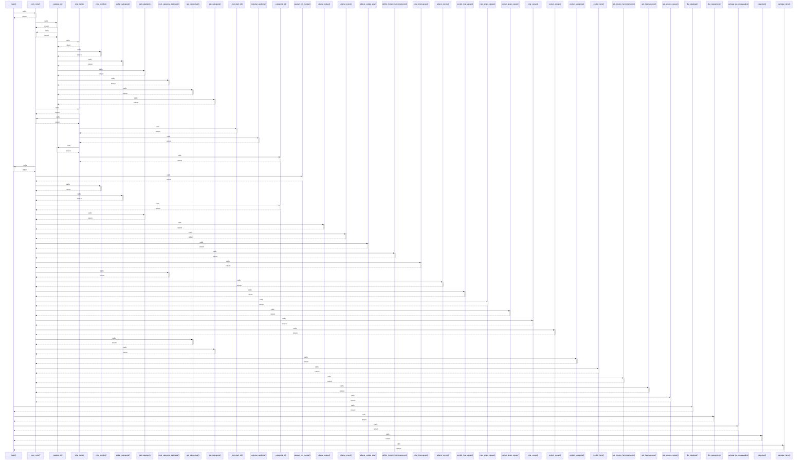

# main()

> God node · 8 connections · [C:\Users\Gustavo\Desktop\automação ifood\scripts\carga_massa.py](file:///C:/Users/Gustavo/Desktop/automa%C3%A7%C3%A3o%20ifood/scripts/carga_massa.py#L51)

## Call Trace Diagram

## Connections by Relation

### calls
- [[com_retry()]] `INFERRED`
- [[list_catalogs()]] `INFERRED`
- [[list_categories()]] `INFERRED`
- [[carregar_ja_processados()]] `EXTRACTED`
- [[registrar()]] `EXTRACTED`
- [[carregar_itens()]] `INFERRED`

### contains
- [[carga_massa.py]] `EXTRACTED`
- [[carga_massa.py]] `EXTRACTED`

---

*Part of the graphify knowledge wiki. See [[index]] to navigate.*