# registrar_auditoria()

> God node · 39 connections · [C:\Users\Gustavo\Desktop\automação ifood\server\app.py](file:///C:/Users/Gustavo/Desktop/automa%C3%A7%C3%A3o%20ifood/server/app.py#L219)

## Call Trace Diagram

```mermaid
sequenceDiagram
    participant P0 as registrar_auditoria()
    participant P1 as _supabase_headers()
    participant P2 as convidar_usuario()
    participant P3 as str
    participant P4 as _marcar_senha_temporaria()
    participant P5 as _gerar_senha_aleatoria()
    participant P6 as resetar_senha_usuario()
    participant P7 as _atualizar_status_pedido()
    participant P8 as _registrar_e_materializar_evento()
    participant P9 as usuario_atual()
    participant P10 as _criar_pedido_local()
    participant P11 as _processar_eventos_da_loja()
    participant P12 as get_lojas()
    participant P13 as criar_loja()
    participant P14 as remover_loja()
    participant P15 as alterar_papel_usuario()
    participant P16 as alterar_status_pedido()
    participant P17 as ocultar_pedido_kds()
    participant P18 as _upsert_pedido_99()
    participant P19 as get_auditoria()
    participant P20 as listar_usuarios()
    participant P21 as get_pedidos()
    participant P22 as get_eventos()
    participant P23 as webhook_ifood()
    participant P24 as get_pedido_detalhe()
    participant P25 as criar_item()
    participant P26 as pausar_em_massa()
    participant P27 as criar_combo()
    participant P28 as editar_categoria()
    participant P29 as alterar_status()
    participant P30 as alterar_preco()
    participant P31 as alterar_codigo_pdv()
    participant P32 as criar_interrupcao()
    participant P33 as alterar_status_opcao()
    participant P34 as editar_opcao()
    participant P35 as editar_item()
    participant P36 as criar_categoria_dedicada()
    participant P37 as alterar_turnos()
    participant P38 as criar_pedido_teste_99()
    participant P39 as definir_horario_funcionamento()
    participant P40 as criar_grupo_opcao()
    participant P41 as criar_opcao()
    participant P42 as excluir_item()
    participant P43 as editar_item_99food()
    participant P44 as criar_item_99food()
    participant P45 as excluir_interrupcao()
    participant P46 as excluir_grupo_opcao()
    participant P47 as excluir_opcao()
    participant P48 as excluir_categoria()
    participant P49 as alterar_status_99food()
    participant P50 as alterar_preco_99food()
    participant P51 as alterar_codigo_pdv_99food()
    participant P52 as alterar_nome_descricao_99food()
    P0->>+ P1: calls
    P1-->>- P0: return
    P1->>+ P0: calls
    P0-->>- P1: return
    P1->>+ P2: calls
    P2-->>- P1: return
    P2->>+ P3: calls
    P3-->>- P2: return
    P2->>+ P0: calls
    P0-->>- P2: return
    P2->>+ P1: calls
    P1-->>- P2: return
    P2->>+ P4: calls
    P4-->>- P2: return
    P2->>+ P5: calls
    P5-->>- P2: return
    P1->>+ P6: calls
    P6-->>- P1: return
    P6->>+ P3: calls
    P3-->>- P6: return
    P6->>+ P0: calls
    P0-->>- P6: return
    P6->>+ P1: calls
    P1-->>- P6: return
    P6->>+ P4: calls
    P4-->>- P6: return
    P6->>+ P5: calls
    P5-->>- P6: return
    P1->>+ P7: calls
    P7-->>- P1: return
    P1->>+ P8: calls
    P8-->>- P1: return
    P1->>+ P9: calls
    P9-->>- P1: return
    P1->>+ P4: calls
    P4-->>- P1: return
    P1->>+ P10: calls
    P10-->>- P1: return
    P1->>+ P11: calls
    P11-->>- P1: return
    P1->>+ P12: calls
    P12-->>- P1: return
    P1->>+ P13: calls
    P13-->>- P1: return
    P1->>+ P14: calls
    P14-->>- P1: return
    P1->>+ P15: calls
    P15-->>- P1: return
    P1->>+ P16: calls
    P16-->>- P1: return
    P1->>+ P17: calls
    P17-->>- P1: return
    P1->>+ P18: calls
    P18-->>- P1: return
    P1->>+ P19: calls
    P19-->>- P1: return
    P1->>+ P20: calls
    P20-->>- P1: return
    P1->>+ P21: calls
    P21-->>- P1: return
    P1->>+ P22: calls
    P22-->>- P1: return
    P1->>+ P23: calls
    P23-->>- P1: return
    P1->>+ P24: calls
    P24-->>- P1: return
    P0->>+ P25: calls
    P25-->>- P0: return
    P0->>+ P2: calls
    P2-->>- P0: return
    P0->>+ P6: calls
    P6-->>- P0: return
    P0->>+ P26: calls
    P26-->>- P0: return
    P0->>+ P27: calls
    P27-->>- P0: return
    P0->>+ P7: calls
    P7-->>- P0: return
    P0->>+ P28: calls
    P28-->>- P0: return
    P0->>+ P29: calls
    P29-->>- P0: return
    P0->>+ P30: calls
    P30-->>- P0: return
    P0->>+ P31: calls
    P31-->>- P0: return
    P0->>+ P32: calls
    P32-->>- P0: return
    P0->>+ P33: calls
    P33-->>- P0: return
    P0->>+ P34: calls
    P34-->>- P0: return
    P0->>+ P35: calls
    P35-->>- P0: return
    P0->>+ P36: calls
    P36-->>- P0: return
    P0->>+ P37: calls
    P37-->>- P0: return
    P0->>+ P38: calls
    P38-->>- P0: return
    P0->>+ P13: calls
    P13-->>- P0: return
    P0->>+ P14: calls
    P14-->>- P0: return
    P0->>+ P15: calls
    P15-->>- P0: return
    P0->>+ P39: calls
    P39-->>- P0: return
    P0->>+ P40: calls
    P40-->>- P0: return
    P0->>+ P41: calls
    P41-->>- P0: return
    P0->>+ P42: calls
    P42-->>- P0: return
    P0->>+ P43: calls
    P43-->>- P0: return
    P0->>+ P44: calls
    P44-->>- P0: return
    P0->>+ P45: calls
    P45-->>- P0: return
    P0->>+ P46: calls
    P46-->>- P0: return
    P0->>+ P47: calls
    P47-->>- P0: return
    P0->>+ P48: calls
    P48-->>- P0: return
    P0->>+ P49: calls
    P49-->>- P0: return
    P0->>+ P50: calls
    P50-->>- P0: return
    P0->>+ P51: calls
    P51-->>- P0: return
    P0->>+ P52: calls
    P52-->>- P0: return
```

## Connections by Relation

### calls
- [[_supabase_headers()]] `EXTRACTED`
- [[criar_item()]] `EXTRACTED`
- [[convidar_usuario()]] `EXTRACTED`
- [[resetar_senha_usuario()]] `EXTRACTED`
- [[pausar_em_massa()]] `EXTRACTED`
- [[criar_combo()]] `EXTRACTED`
- [[_atualizar_status_pedido()]] `EXTRACTED`
- [[editar_categoria()]] `EXTRACTED`
- [[alterar_status()]] `EXTRACTED`
- [[alterar_preco()]] `EXTRACTED`
- [[alterar_codigo_pdv()]] `EXTRACTED`
- [[criar_interrupcao()]] `EXTRACTED`
- [[alterar_status_opcao()]] `EXTRACTED`
- [[editar_opcao()]] `EXTRACTED`
- [[editar_item()]] `EXTRACTED`
- [[criar_categoria_dedicada()]] `EXTRACTED`
- [[alterar_turnos()]] `EXTRACTED`
- [[criar_pedido_teste_99()]] `EXTRACTED`
- [[criar_loja()]] `EXTRACTED`
- [[remover_loja()]] `EXTRACTED`

### contains
- [[app.py]] `EXTRACTED`
- [[app.py]] `EXTRACTED`

### rationale_for
- [[Grava uma linha na tabela `auditoria` do Supabase para toda ação que altera o ca]] `EXTRACTED`
- [[Grava uma linha na tabela `auditoria` do Supabase para toda ação que altera o ca]] `EXTRACTED`

---

*Part of the graphify knowledge wiki. See [[index]] to navigate.*